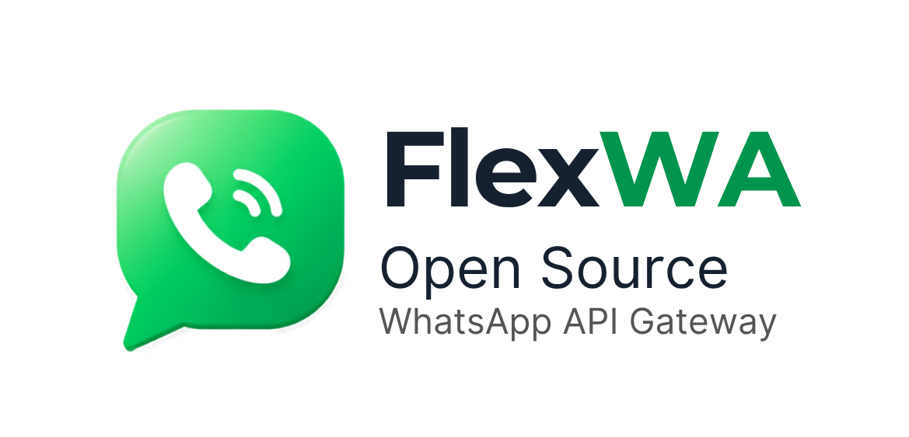

<p align="center">
  
</p>

<p align="center">
  <strong>Open Source WhatsApp API Gateway</strong>
</p>

<p align="center">
  <a href="#-features">Features</a> •
  <a href="#-quick-start">Quick Start</a> •
  <a href="#-documentation">Docs</a> •
  <a href="#-api-examples">API</a> •
  <a href="#-contributing">Contributing</a>
</p>

---

## ✨ Why FlexWA?

**FlexWA** is a free, open-source WhatsApp API Gateway designed for developers who need full control over their messaging infrastructure—without vendor lock-in or hidden paywalls.

Built on a **pluggable architecture**, FlexWA lets you select database engines (SQLite/PostgreSQL), backup/migration storage backends (Local/S3), and cache layers (disabled/Redis) through configuration rather than application-code changes. Message media itself is returned inline to API and webhook consumers; it is not automatically persisted to the storage backend.

|                               |                                                                                            |
| ----------------------------- | ------------------------------------------------------------------------------------------ |
| 🔓 **100% Open Source**       | No licensing fees, no feature locks, full source code access                               |
| 🏗️ **Pluggable Architecture** | Swap adapters for database, storage, and cache via config                                  |
| 🖥️ **Full Dashboard**         | Modern React UI for session, webhook, and API key management                               |
| 🔹 **Multi-Session Ready**    | Run multiple WhatsApp sessions concurrently on one instance                                |
| 🐳 **Docker Native**          | Production-ready with zero configuration                                                   |
| 🔗 **n8n Integration**        | Community nodes for workflow automation                                                    |
| 🧩 **Community Adapters**     | Third-party integrations (e.g. ioBroker) — see [docs](./docs/23-community-integrations.md) |

---

## 🎯 Features

### Core Features

| Feature       | Status | Description                                                                  |
| ------------- | ------ | ---------------------------------------------------------------------------- |
| REST API      | ✅     | Full WhatsApp API via HTTP endpoints                                         |
| Multi-Session | ✅     | Manage multiple WhatsApp accounts                                            |
| Webhooks      | ✅     | Real-time events with HMAC signature and optional smart pre-dispatch filters |
| Web Dashboard | ✅     | Visual management interface                                                  |
| API Key Auth  | ✅     | Secure API authentication                                                    |
| Swagger Docs  | ✅     | Interactive API documentation                                                |

### Messaging

| Feature           | Status | Description                                  |
| ----------------- | ------ | -------------------------------------------- |
| Text Messages     | ✅     | Send/receive text messages                   |
| Media Messages    | ✅     | Images, videos, documents, audio             |
| Message Reactions | ✅     | React to messages with emoji                 |
| Message Editing   | ✅     | Live `message.edited` events on both engines |
| Bulk Messaging    | ✅     | Send to multiple recipients                  |
| Message Status    | ✅     | Track delivery and read receipts             |

### Advanced

| Feature             | Status | Description                        |
| ------------------- | ------ | ---------------------------------- |
| Groups API          | ✅     | Create, manage, and message groups |
| Channels/Newsletter | ✅     | WhatsApp Channels support          |
| Labels Management   | ✅     | Organize chats with labels         |
| Proxy Support       | ✅     | Per-session proxy configuration    |
| Rate Limiting       | ✅     | Configurable request limits        |
| CIDR Whitelisting   | ✅     | IP-based access control            |
| Audit Logging       | ✅     | Track all API operations           |

### Infrastructure

| Feature          | Status | Description                              |
| ---------------- | ------ | ---------------------------------------- |
| SQLite           | ✅     | Zero-config embedded database            |
| PostgreSQL       | ✅     | Production-grade database                |
| Redis Cache      | ✅     | Optional performance caching             |
| S3/MinIO Storage | ✅     | Media-directory backup/migration backend |
| Docker           | ✅     | One-command deployment                   |
| Health Checks    | ✅     | Kubernetes-ready probes                  |
| Data Migration   | ✅     | Export/import between backends           |

---

## 🚀 Quick Start

### Option A: Docker (Recommended)

```bash
# Clone and start
git clone https://github.com/zazubot/FlexWA.git
cd FlexWA
docker compose -f docker-compose.dev.yml up -d

# Access (the dashboard is bundled into the API image and served on the same port)
# Dashboard: http://localhost:2785
# API: http://localhost:2785/api
# Swagger: http://localhost:2785/api/docs
```

> **Using Podman instead of Docker?**
> Podman rootless mode requires the socket to be running and `DOCKER_HOST` to be set:
>
> ```bash
> systemctl --user start podman.socket
> systemctl --user enable podman.socket
> export DOCKER_HOST=unix:///run/user/$(id -u)/podman/podman.sock
> ```
>
> Add the `export` line to your `~/.bashrc` to make it permanent.

### Option B: Local Development

```bash
# Clone repository
git clone https://github.com/zazubot/FlexWA.git
cd FlexWA

# Install dependencies (includes dashboard)
npm install

# Start API + Dashboard (config is auto-generated on first run)
npm run dev

# Access (in dev the dashboard runs on the Vite server with hot reload)
# Dashboard: http://localhost:2886
# API: http://localhost:2785/api
# Swagger: http://localhost:2785/api/docs
```

---

## 🔒 Security Architecture

### Docker Socket Proxy

The production stack never exposes `/var/run/docker.sock` directly to the application container. Instead, a dedicated `docker-proxy` sidecar (based on [`tecnativa/docker-socket-proxy`](https://github.com/Tecnativa/docker-socket-proxy)) acts as the sole gateway to the Docker daemon:

```
FlexWA-api  ──TCP 2375──▶  docker-proxy  ──unix──▶  /var/run/docker.sock
```

Only the operations needed for container orchestration are enabled (`CONTAINERS`, `IMAGES`, `VOLUMES`, `INFO`, `PING`, `POST`, `DELETE`). The application connects via the `DOCKER_HOST=tcp://docker-proxy:2375` environment variable, which `DockerService` detects automatically.

### Non-root Container Execution

The production image never runs the Node.js process as root. On startup, the container follows this chain:

```
dumb-init (PID 1)
  └─ docker-entrypoint.sh (root — fixes named-volume ownership via chown)
       └─ gosu FlexWA node dist/main  (drops to the FlexWA user)
```

- **dumb-init** is PID 1 and forwards signals (SIGTERM, etc.) for graceful shutdown.
- **docker-entrypoint.sh** runs as root only long enough to `chown` the named-volume mount points so the `FlexWA` user can write to them.
- **gosu** performs a clean `exec`-based privilege drop — no `su` or `sudo` wrappers, so the node process is the direct child of dumb-init.

Named volumes (e.g. `FlexWA-data`) get their ownership corrected automatically on every start, so no manual `chown` step is needed after volume creation.

---

## 🏭 Production Deployment

For production, use the main `docker-compose.yml` with optional services:

```bash
# Basic production (SQLite, local storage)
docker compose up -d

# With PostgreSQL database
docker compose --profile postgres up -d

# Full stack (PostgreSQL, Redis, MinIO)
docker compose --profile full up -d
```

| Profile    | Services              |
| ---------- | --------------------- |
| `postgres` | PostgreSQL database   |
| `redis`    | Redis cache           |
| `minio`    | S3-compatible storage |
| `full`     | All services above    |

> The dashboard is bundled into the API image and served by NestJS on the API port, so it
> needs no profile — it is always available wherever `FlexWA-api` runs. For TLS/public exposure,
> put your own reverse proxy (nginx, Caddy, a cloud load balancer, or a k8s Ingress) in front;
> see the nginx example in `docs/12-troubleshooting-faq.md`.

> **Development vs Production**
>
> - Development (`docker-compose.dev.yml`): SQLite, local storage, API serves the bundled dashboard
> - Production (`docker-compose.yml`): Configurable database, profiles for optional services
>
> Official GHCR images are published as multi-arch manifests for:
>
> - `linux/amd64`
> - `linux/arm64`

## 🔌 Ports

| Service         | Port            | Description                                     |
| --------------- | --------------- | ----------------------------------------------- |
| API & Dashboard | `2785`          | REST API + bundled web dashboard (same port)    |
| Swagger         | `2785/api/docs` | Interactive API docs                            |
| Dashboard (dev) | `2886`          | Vite dev server with hot reload (`npm run dev`) |

---

## 📡 API Examples

### Create a Session

```bash
curl -X POST http://localhost:2785/api/sessions \
  -H "Content-Type: application/json" \
  -H "X-API-Key: YOUR_API_KEY" \
  -d '{"name": "my-bot"}'
```

### Start Session & Get QR Code

```bash
# Start the session
curl -X POST http://localhost:2785/api/sessions/{sessionId}/start \
  -H "X-API-Key: YOUR_API_KEY"

# Get QR code (scan with WhatsApp)
curl http://localhost:2785/api/sessions/{sessionId}/qr \
  -H "X-API-Key: YOUR_API_KEY"
```

### Send a Message

```bash
curl -X POST http://localhost:2785/api/sessions/{sessionId}/messages/send-text \
  -H "Content-Type: application/json" \
  -H "X-API-Key: YOUR_API_KEY" \
  -d '{
    "chatId": "628123456789@c.us",
    "text": "Hello from FlexWA!"
  }'
```

### Setup Webhook

```bash
curl -X POST http://localhost:2785/api/sessions/{sessionId}/webhooks \
  -H "Content-Type: application/json" \
  -H "X-API-Key: YOUR_API_KEY" \
  -d '{
    "url": "https://your-server.com/webhook",
    "events": ["message.received", "session.status"],
    "secret": "your-hmac-secret"
  }'
```

> **Smart filters (optional):** add a `filters` object to fire the webhook only when conditions match
> (AND), e.g. `{ "conditions": [{ "field": "sender", "operator": "is", "value": ["1234567890@c.us"] }] }`.
> Fields: `sender` / `recipient` / `body` / `type` / `mentions` / `fromMe` / `hasMedia` / `isGroup`. A
> webhook with no filters behaves exactly as before. See the API specification for the full schema.

## 🤖 MCP Server (AI Agents)

FlexWA can expose a **curated set of tools over the [Model Context Protocol](https://modelcontextprotocol.io)** so AI agents (Claude, Cursor, …) can drive WhatsApp. It is **off by default** and **additive** — every REST route keeps working unchanged.

Set `MCP_ENABLED=true` to mount a stateless Streamable-HTTP transport at **`POST /mcp`** on the existing server (same port, no extra process). It exposes ~39 curated tools (sessions, messaging, contacts, basic group ops, webhook reads) — a focused surface rather than the full API, so agents aren't overwhelmed and destructive operations stay off the agent path.

```bash
MCP_ENABLED=true npm run start:prod   # or set MCP_ENABLED in your .env / compose
```

Point an MCP client at it (e.g. for Claude Code, a `.mcp.json` at your project root):

```json
{
  "mcpServers": {
    "FlexWA": {
      "type": "http",
      "url": "http://localhost:2785/mcp",
      "headers": { "Authorization": "Bearer YOUR_API_KEY" }
    }
  }
}
```

The key can be passed as `Authorization: Bearer …` or `X-API-Key: …`. Every tool call goes through the **same API-key auth, role, and per-session scoping** as REST.

**Security guidance:**

- **Mint a dedicated, least-privilege key** for the agent — a non-admin, **session-scoped** key (`OPERATOR` role at most). The plaintext key is shown only once on creation; to rotate, create a new key and delete the old one.
- The key **must not** carry an IP allow-list (`allowedIps`) — there is no genuine client IP over MCP, so such a key is rejected.
- Set **`MCP_READONLY=true`** to mount only the read tools (no sends/writes).
- Set **`MCP_RATE_LIMIT_MAX`** (default `60`) to limit tool calls per API key per window.
- Set **`MCP_RATE_LIMIT_WINDOW_MS`** (default `60000`) to control the sliding window size in milliseconds.
- **Do not expose `/mcp` to the public internet** without a fronting auth proxy. For a self-hosted, locally-reached deployment the static API key is appropriate; public exposure should use OAuth 2.1 (not yet built).

---

## 🛠 Tech Stack

| Layer         | Technology                                              |
| ------------- | ------------------------------------------------------- |
| **Runtime**   | Node.js 22 LTS                                          |
| **Framework** | NestJS 11.x                                             |
| **Language**  | TypeScript 5.x                                          |
| **WA Engine** | whatsapp-web.js (default) / baileys — set `ENGINE_TYPE` |
| **Database**  | SQLite / PostgreSQL                                     |
| **Cache**     | Redis (optional)                                        |
| **Storage**   | Local / S3 / MinIO                                      |
| **ORM**       | TypeORM                                                 |
| **Container** | Docker + Docker Compose                                 |

---

## 📁 Project Structure

```
FlexWA/
├── src/
│   ├── main.ts                 # Application entry point
│   ├── app.module.ts           # Root module
│   ├── config/                 # Configuration
│   ├── common/                 # Shared utilities
│   │   ├── cache/              # Redis caching
│   │   └── storage/            # File storage (Local/S3)
│   ├── core/                   # Core systems
│   │   ├── hooks/              # Plugin hooks
│   │   └── plugins/            # Plugin system
│   ├── engine/                 # WhatsApp engine abstraction
│   └── modules/
│       ├── session/            # Session management
│       ├── message/            # Message handling
│       ├── webhook/            # Webhook management
│       ├── group/              # Groups API
│       ├── contact/            # Contacts API
│       ├── auth/               # API key authentication
│       ├── infra/              # Infrastructure management
│       └── health/             # Health checks
├── dashboard/                  # React web dashboard
├── docs/                      # Documentation
├── docker-compose.yml
├── Dockerfile
└── package.json
```

---

## 📚 Documentation

Comprehensive documentation is available in the `docs/` folder:

| Document                                                | Description                  |
| ------------------------------------------------------- | ---------------------------- |
| [Project Overview](./docs/01-project-overview.md)       | Introduction and goals       |
| [Requirements](./docs/02-requirements-specification.md) | Feature specifications       |
| [Architecture](./docs/03-system-architecture.md)        | System design                |
| [Security](./docs/04-security-design.md)                | Security implementation      |
| [Database](./docs/05-database-design.md)                | Data models and migrations   |
| [API Spec](./docs/06-api-specification.md)              | Complete API reference       |
| [Development](./docs/08-development-guidelines.md)      | Coding standards             |
| [Migration Guide](./docs/14-migration-guide.md)         | Database & storage migration |

---

## 🤝 Contributing

We welcome contributions! Here's how to get started:

1. **Fork** the repository
2. **Create** your feature branch (`git checkout -b feature/amazing-feature`)
3. **Commit** your changes (`git commit -m 'Add amazing feature'`)
4. **Push** to the branch (`git push origin feature/amazing-feature`)
5. **Open** a Pull Request

Please read our [Development Guidelines](./docs/08-development-guidelines.md) for coding standards and best practices.

---

## 📄 License

This project is licensed under the **MIT License** – free for personal and commercial use.

See [LICENSE](./LICENSE) for details.

---

<div align="center">

**FlexWA** – Free, Open Source WhatsApp API Gateway

[📖 Documentation](./docs/README.md) · [🔌 API Docs](http://localhost:2785/api/docs) · [🐛 Report Bug](https://github.com/zazubot/FlexWA/issues) · [💡 Request Feature](https://github.com/zazubot/FlexWA/issues)

<br/>

</div>
