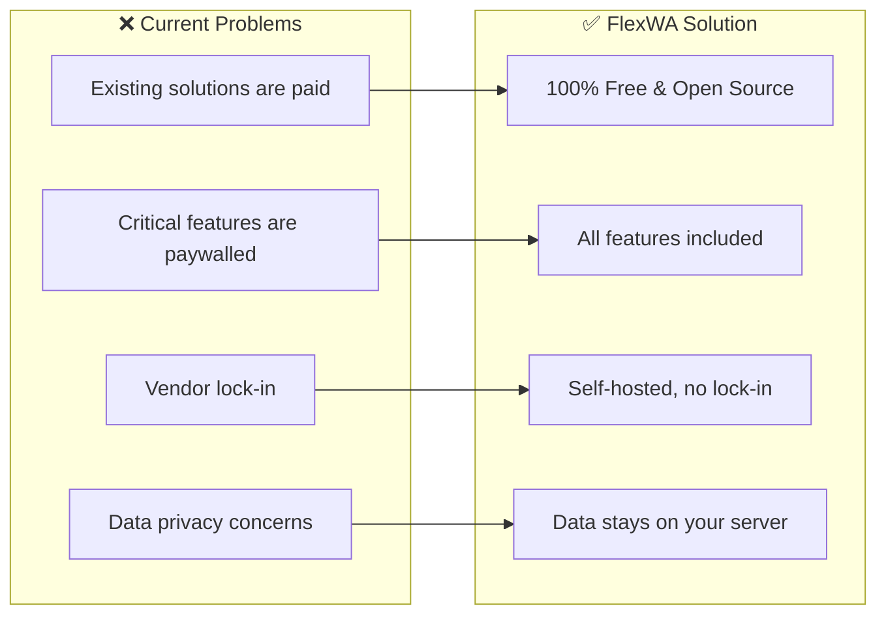
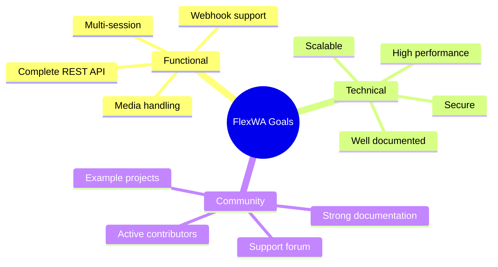
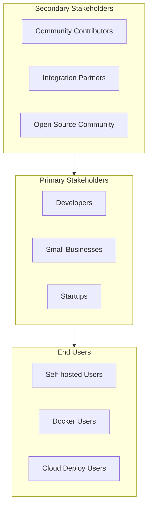
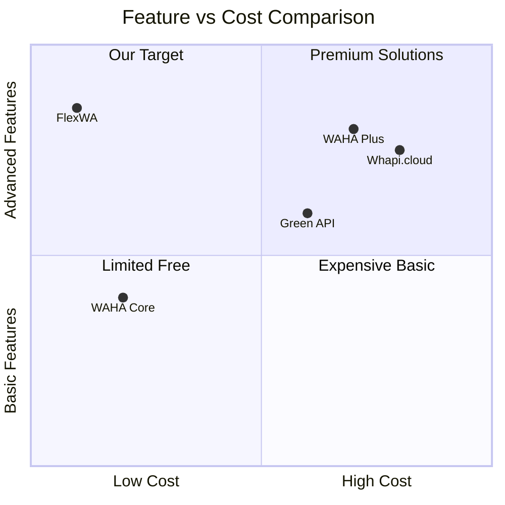

# 01 - Project Overview

## 1.1 Executive Summary

**FlexWA** is an open-source platform that provides an HTTP API for WhatsApp integration. This project is built as a free and fully open-source alternative to paid solutions such as WAHA Plus.

### Core Values

```
┌─────────────────────────────────────────────────────────────┐
│                      FlexWA Values                          │
├─────────────────────────────────────────────────────────────┤
│  🆓 100% Free         │  No paywalled features               │
│  📖 Open Source       │  MIT License, fork friendly          │
│  🔒 Self-Hosted       │  Data stays on your own server       │
│  🚀 Production Ready  │  Scalable & reliable                 │
│  🎯 Developer First   │  Simple, intuitive API               │
└─────────────────────────────────────────────────────────────┘
```

## 1.2 Vision & Mission

### Vision

To become the most reliable open-source WhatsApp API gateway for production use.

### Mission

1. Provide a complete and free WhatsApp REST API
2. Build an active open-source community
3. Deliver excellent documentation and tooling
4. Ensure user data security and privacy

## 1.3 Problem Statement



### Pain Points Addressed

| Pain Point                          | FlexWA Solution              |
| ----------------------------------- | ---------------------------- |
| WAHA Plus charges for multi-session | Free unlimited multi-session |
| Dashboard only in paid tiers        | Free dashboard               |
| PostgreSQL support is paid          | PostgreSQL included          |
| Limited webhook management          | Full webhook management      |
| No source code access               | Full source code available   |

## 1.4 Project Goals

### Primary Goals



### Success Metrics

| Metric              | Target (6 months) | Target (1 year) |
| ------------------- | ----------------- | --------------- |
| GitHub Stars        | 500+              | 2000+           |
| Active Contributors | 10+               | 30+             |
| Docker Pulls        | 5,000+            | 20,000+         |
| Production Users    | 100+              | 500+            |
| API Uptime          | 99.5%             | 99.9%           |

## 1.5 Project Scope

### In Scope ✅

```
Phase 1 (MVP)
├── REST API
│   ├── Session management (create, delete, status)
│   ├── QR code authentication
│   ├── Send messages (text, image, video, audio, document)
│   ├── Receive messages via webhook
│   ├── Contact management
│   └── Basic group operations
├── Infrastructure
│   ├── Docker support
│   ├── SQLite database
│   ├── Swagger documentation
│   └── Health check endpoints
└── Documentation
    ├── API documentation
    ├── Setup guide
    └── Basic examples

Phase 2 (Production Ready)
├── Multi-session support
├── PostgreSQL support
├── Web Dashboard
├── Webhook management UI
├── Message queue (Redis/Bull)
├── Rate limiting
└── Authentication (API Key)

Phase 3 (Advanced)
├── Group management (create, modify, participants)
├── Channels/Newsletter support
├── Label management
├── Status/Stories
├── Proxy per session
├── Horizontal scaling design reference
└── Metrics & monitoring
```

### Out of Scope ❌

- WhatsApp Business API (official Meta API)
- Mobile app
- End-user chat interface
- Message scheduling (to be a separate plugin)
- CRM features
- Billing/payment integration

## 1.6 Stakeholders



### Target Users

1. **Developers** - Need WhatsApp integration for their applications
2. **Small Businesses** - Need customer service automation
3. **Startups** - Need cost-effective solutions
4. **Agencies** - Manage multiple WhatsApp accounts

## 1.7 Competitive Analysis



### Feature Comparison

| Feature       | FlexWA | WAHA Core | WAHA Plus | Whapi.cloud |
| ------------- | ------ | --------- | --------- | ----------- |
| Price         | Free   | Free      | $50+/mo   | $30+/mo     |
| Open Source   | ✅     | ❌        | ❌        | ❌          |
| Multi-session | ✅     | Limited   | ✅        | ✅          |
| Dashboard     | ✅     | ❌        | ✅        | ✅          |
| PostgreSQL    | ✅     | ❌        | ✅        | N/A         |
| Webhook UI    | ✅     | ❌        | ✅        | ✅          |
| Self-hosted   | ✅     | ✅        | ✅        | ❌          |
| Source code   | ✅     | ❌        | ❌        | ❌          |

## 1.8 Technology Decisions

### Why These Technologies?

```mermaid
flowchart TB
    subgraph Runtime["Runtime & Framework"]
        N[Node.js 22 LTS] --> |"TypeScript support, async/await"| NE[NestJS]
        NE --> |"Modular, scalable, DI"| API[REST API]
    end

    subgraph Engine["WhatsApp Engine (pluggable)"]
        WW[whatsapp-web.js] --> |"Puppeteer based"| P[More stealth]
        P --> |"Real browser fingerprint"| S[Lower ban risk]
        BA[baileys] --> |"Browser-free / WebSocket"| BL[Lower resource usage]
    end

    subgraph Storage["Data Storage"]
        SQ[SQLite] --> |"Development"| DEV[Easy setup]
        PG[PostgreSQL] --> |"Production"| PROD[Scalable]
    end

    subgraph Frontend["Dashboard"]
        R[React] --> V[Vite]
        V --> C[Bespoke CSS]
        C --> L[Lucide Icons]
        L --> UI[Modern UI]
    end
```



### Technology Stack Summary

| Layer         | Technology                           | Rationale                                                                               |
| ------------- | ------------------------------------ | --------------------------------------------------------------------------------------- |
| Runtime       | Node.js 22 LTS                       | Stable, long-term support                                                               |
| Language      | TypeScript                           | Type safety, better developer experience                                                |
| Framework     | NestJS                               | Enterprise-grade, modular                                                               |
| WA Engine     | whatsapp-web.js (default) or baileys | Pluggable via `ENGINE_TYPE` env var; wwebjs = Puppeteer/stealth, baileys = browser-free |
| Browser       | Puppeteer/Chrome                     | Used by default (whatsapp-web.js) engine; not required for baileys engine               |
| Database      | SQLite (default) / PostgreSQL        | Zero-config default, PostgreSQL for scaling                                             |
| Cache         | Redis                                | Fast, pub/sub support                                                                   |
| Queue         | Bull                                 | Reliable job processing                                                                 |
| Dashboard     | React + Vite                         | Fast, modern                                                                            |
| Styling       | Bespoke CSS modules/stylesheets      | Lightweight dashboard styling without Tailwind                                          |
| UI Components | Custom React components + Lucide     | Accessible, polished                                                                    |
| Container     | Docker                               | Portable, consistent                                                                    |

## 1.9 Constraints & Assumptions

### Constraints

1. **Technical**
   - WhatsApp Web protocol can change at any time
   - Puppeteer requires significant resources (~300-500MB RAM per session) when using the default whatsapp-web.js engine; the baileys engine is browser-free and has a much lower footprint
   - WhatsApp rate limiting

2. **Legal**
   - Unofficial API, not affiliated with Meta
   - Users are responsible for compliant usage

3. **Resource**
   - Open-source project, dependent on community contributions
   - Limited maintainer capacity initially

### Assumptions

1. Users have servers with at least 2GB RAM
2. Users are familiar with Docker or Node.js
3. Users understand the risks of using an unofficial API
4. WhatsApp Web will remain available

## 1.10 Document History

| Version | Date       | Author | Changes          |
| ------- | ---------- | ------ | ---------------- |
| 1.0     | 2026-02-02 | Team   | Initial document |

---

<div align="center">

[Documentation Index](./README.md) · [Next: 02 - Requirements Specification →](./02-requirements-specification.md)

</div>
