# 02 - Requirements Specification

## 2.1 Overview

This document defines the functional and non-functional requirements for FlexWA.

## 2.2 Functional Requirements

### 2.2.1 Session Management

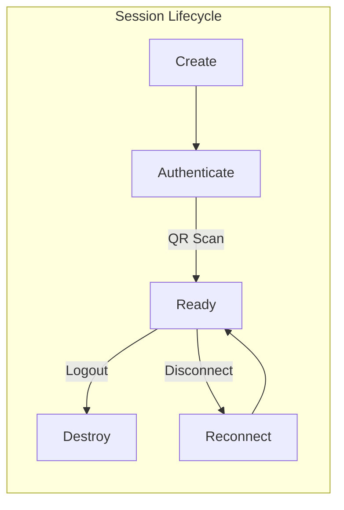

| ID        | Requirement                                                | Priority | Phase |
| --------- | ---------------------------------------------------------- | -------- | ----- |
| FR-SM-001 | The system must create new sessions                        | High     | 1     |
| FR-SM-002 | The system must generate a QR code for authentication      | High     | 1     |
| FR-SM-003 | The system must persist session state for reconnection     | High     | 1     |
| FR-SM-004 | The system must delete a session                           | High     | 1     |
| FR-SM-005 | The system must display session status                     | High     | 1     |
| FR-SM-006 | The system must support multiple sessions                  | High     | 2     |
| FR-SM-007 | The system must auto-reconnect when the connection is lost | Medium   | 2     |
| FR-SM-008 | The system must support session naming                     | Low      | 2     |

### 2.2.2 Messaging

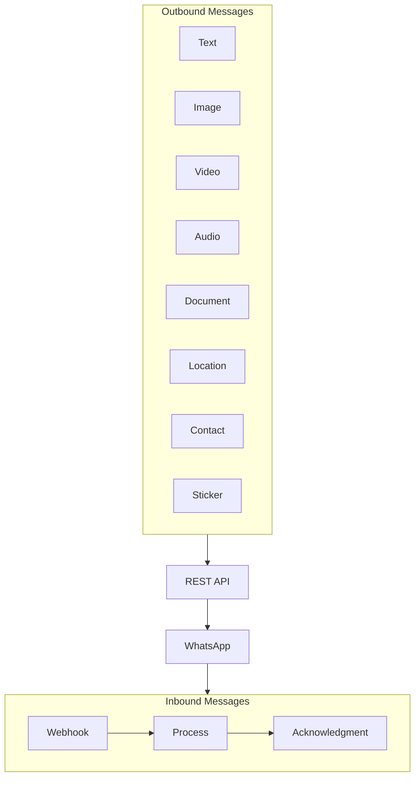

| ID         | Requirement                                                      | Priority | Phase |
| ---------- | ---------------------------------------------------------------- | -------- | ----- |
| FR-MSG-001 | The system must send text messages                               | High     | 1     |
| FR-MSG-002 | The system must send images with captions                        | High     | 1     |
| FR-MSG-003 | The system must send video messages                              | High     | 1     |
| FR-MSG-004 | The system must send audio/voice notes                           | High     | 1     |
| FR-MSG-005 | The system must send documents/files                             | High     | 1     |
| FR-MSG-006 | The system must send locations                                   | Medium   | 2     |
| FR-MSG-007 | The system must send contact cards                               | Medium   | 2     |
| FR-MSG-008 | The system must send stickers                                    | Medium   | 2     |
| FR-MSG-009 | The system must reply to a message                               | Medium   | 2     |
| FR-MSG-010 | The system must forward messages                                 | Low      | 3     |
| FR-MSG-011 | The system must delete messages                                  | Low      | 3     |
| FR-MSG-012 | The system must react to messages                                | Low      | 3     |
| FR-MSG-013 | The system must send bulk messages (batch)                       | Medium   | 2     |
| FR-MSG-014 | The system must support template variables in bulk messages      | Medium   | 2     |
| FR-MSG-015 | The system must track status per message in a batch              | Medium   | 2     |
| FR-MSG-016 | The system must cancel a running batch                           | Medium   | 2     |
| FR-MSG-017 | The system must apply delays between messages to reduce ban risk | High     | 2     |
| FR-MSG-018 | The system must validate media size before sending               | High     | 1     |
| FR-MSG-019 | The system must support downloading media from a URL             | High     | 1     |

### 2.2.3 Webhook & Events

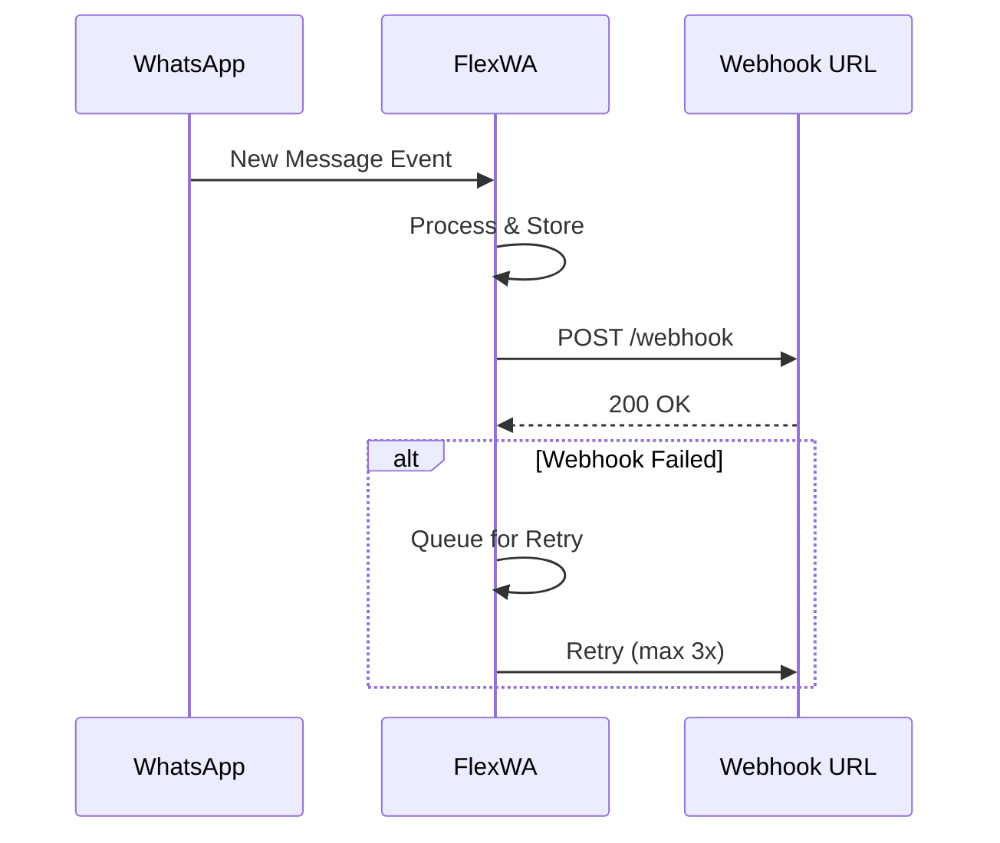

| ID        | Requirement                                              | Priority | Phase |
| --------- | -------------------------------------------------------- | -------- | ----- |
| FR-WH-001 | The system must deliver events to webhook URLs           | High     | 1     |
| FR-WH-002 | The system must support multiple webhook URLs            | Medium   | 2     |
| FR-WH-003 | The system must retry failed webhooks (max 3x)           | Medium   | 2     |
| FR-WH-004 | The system must filter event types per webhook           | Medium   | 2     |
| FR-WH-005 | The system must log webhook delivery status              | Medium   | 2     |
| FR-WH-006 | The system must support webhook signature verification   | Medium   | 2     |
| FR-WH-007 | The system must provide an idempotency key per event     | High     | 2     |
| FR-WH-008 | The system must provide a delivery ID to track retries   | Medium   | 2     |
| FR-WH-009 | The system must support exponential backoff for retries  | Medium   | 2     |
| FR-WH-010 | The system must enable/disable webhooks without deletion | Low      | 2     |

### 2.2.4 Real-time Updates (WebSocket)

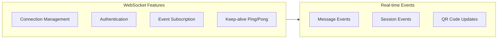

| ID        | Requirement                                                        | Priority | Phase |
| --------- | ------------------------------------------------------------------ | -------- | ----- |
| FR-WS-001 | The system must provide a WebSocket endpoint for real-time updates | Medium   | 2     |
| FR-WS-002 | The system must support API key authentication for WebSocket       | Medium   | 2     |
| FR-WS-003 | The system must allow subscribing to a specific session            | Medium   | 2     |
| FR-WS-004 | The system must allow subscribing to specific event types          | Medium   | 2     |
| FR-WS-005 | The system must implement ping/pong keep-alive                     | Medium   | 2     |
| FR-WS-006 | The system must auto-reconnect with exponential backoff            | Low      | 3     |
| FR-WS-007 | The system must stream QR code updates in real time                | High     | 2     |

### 2.2.5 Contact Management

| ID        | Requirement                                          | Priority | Phase |
| --------- | ---------------------------------------------------- | -------- | ----- |
| FR-CT-001 | The system must retrieve all contacts                | High     | 1     |
| FR-CT-002 | The system must retrieve a contact by ID             | High     | 1     |
| FR-CT-003 | The system must check if a number exists on WhatsApp | High     | 1     |
| FR-CT-004 | The system must retrieve a contact profile picture   | Medium   | 2     |
| FR-CT-005 | The system must block/unblock a contact              | Low      | 3     |

### 2.2.6 Group Management

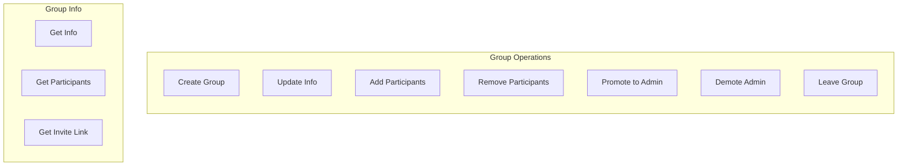

| ID        | Requirement                                 | Priority | Phase |
| --------- | ------------------------------------------- | -------- | ----- |
| FR-GR-001 | The system must retrieve all groups         | Medium   | 2     |
| FR-GR-002 | The system must retrieve group info         | Medium   | 2     |
| FR-GR-003 | The system must retrieve group participants | Medium   | 2     |
| FR-GR-004 | The system must create a group              | Medium   | 3     |
| FR-GR-005 | The system must update group info           | Low      | 3     |
| FR-GR-006 | The system must add participants            | Low      | 3     |
| FR-GR-007 | The system must remove participants         | Low      | 3     |
| FR-GR-008 | The system must promote/demote admins       | Low      | 3     |
| FR-GR-009 | The system must get/revoke invite links     | Low      | 3     |
| FR-GR-010 | The system must leave a group               | Low      | 3     |

### 2.2.7 Dashboard (Web UI)

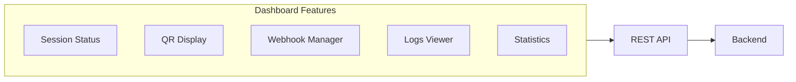

| ID        | Requirement                                           | Priority | Phase |
| --------- | ----------------------------------------------------- | -------- | ----- |
| FR-UI-001 | The dashboard must display the status of all sessions | High     | 2     |
| FR-UI-002 | The dashboard must display QR codes                   | High     | 2     |
| FR-UI-003 | The dashboard must manage webhooks                    | Medium   | 2     |
| FR-UI-004 | The dashboard must view logs                          | Medium   | 2     |
| FR-UI-005 | The dashboard must test sending messages              | Medium   | 2     |
| FR-UI-006 | The dashboard must display statistics                 | Low      | 3     |
| FR-UI-007 | The dashboard must support dark mode                  | Low      | 3     |

### 2.2.8 Authentication & Authorization

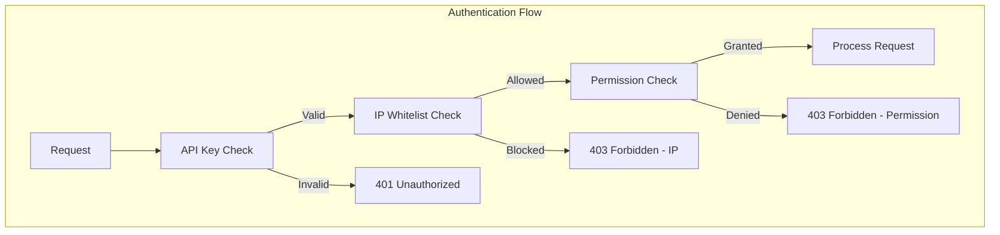

| ID        | Requirement                                                           | Priority | Phase |
| --------- | --------------------------------------------------------------------- | -------- | ----- |
| FR-AU-001 | The system must support API key authentication                        | High     | 2     |
| FR-AU-002 | The system must generate/revoke API keys                              | High     | 2     |
| FR-AU-003 | The system must set permissions per API key                           | Medium   | 3     |
| FR-AU-004 | The system must log API access                                        | Medium   | 2     |
| FR-AU-005 | The system must support IP whitelisting per API key                   | Medium   | 2     |
| FR-AU-006 | The system must support CIDR notation for IP ranges                   | Low      | 2     |
| FR-AU-007 | The system must set expiration dates for API keys                     | Medium   | 2     |
| FR-AU-008 | The system must hash API keys before storage (SHA-256)                | High     | 2     |
| FR-AU-009 | The system must track last used timestamps per API key                | Low      | 2     |
| FR-AU-010 | The system must support a master API key from environment             | High     | 2     |
| FR-AU-011 | The system must support the `X-Request-ID` header for request tracing | Medium   | 2     |

### 2.2.9 Bulk Operations

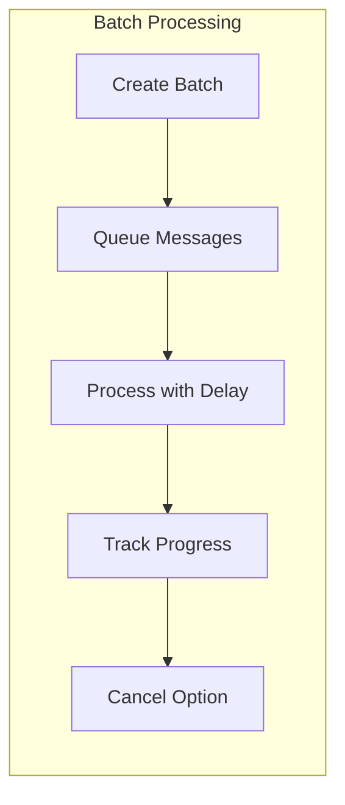

| ID        | Requirement                                                          | Priority | Phase |
| --------- | -------------------------------------------------------------------- | -------- | ----- |
| FR-BK-001 | The system must accept batches up to 100 messages                    | Medium   | 2     |
| FR-BK-002 | The system must apply delays between messages (configurable, min 1s) | High     | 2     |
| FR-BK-003 | The system must randomize delays for natural behavior                | Medium   | 2     |
| FR-BK-004 | The system must track batch progress (sent/failed/pending)           | Medium   | 2     |
| FR-BK-005 | The system must cancel a running batch                               | Medium   | 2     |
| FR-BK-006 | The system must support template variables in batches                | Low      | 3     |
| FR-BK-007 | The system must return a batch ID for status tracking                | High     | 2     |
| FR-BK-008 | The system must clean up completed batches after 24 hours            | Low      | 3     |

## 2.3 Non-Functional Requirements

### 2.3.1 Performance

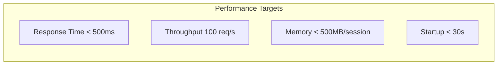

| ID         | Requirement          | Target           | Priority |
| ---------- | -------------------- | ---------------- | -------- |
| NFR-PF-001 | API response time    | < 500ms (p95)    | High     |
| NFR-PF-002 | Message send latency | < 2s             | High     |
| NFR-PF-003 | QR code generation   | < 3s             | High     |
| NFR-PF-004 | Memory per session   | < 500MB          | High     |
| NFR-PF-005 | Concurrent sessions  | 10+ per instance | Medium   |
| NFR-PF-006 | Webhook delivery     | < 5s             | Medium   |
| NFR-PF-007 | Startup time         | < 30s            | Medium   |

### 2.3.2 Reliability & Availability

| ID         | Requirement               | Target               | Priority |
| ---------- | ------------------------- | -------------------- | -------- |
| NFR-RL-001 | Uptime                    | 99.5%                | High     |
| NFR-RL-002 | Auto-recovery after crash | < 60s                | High     |
| NFR-RL-003 | Session persistence       | Survive restart      | High     |
| NFR-RL-004 | Graceful shutdown         | Complete pending ops | Medium   |
| NFR-RL-005 | Data durability           | No message loss      | High     |

### 2.3.3 Scalability

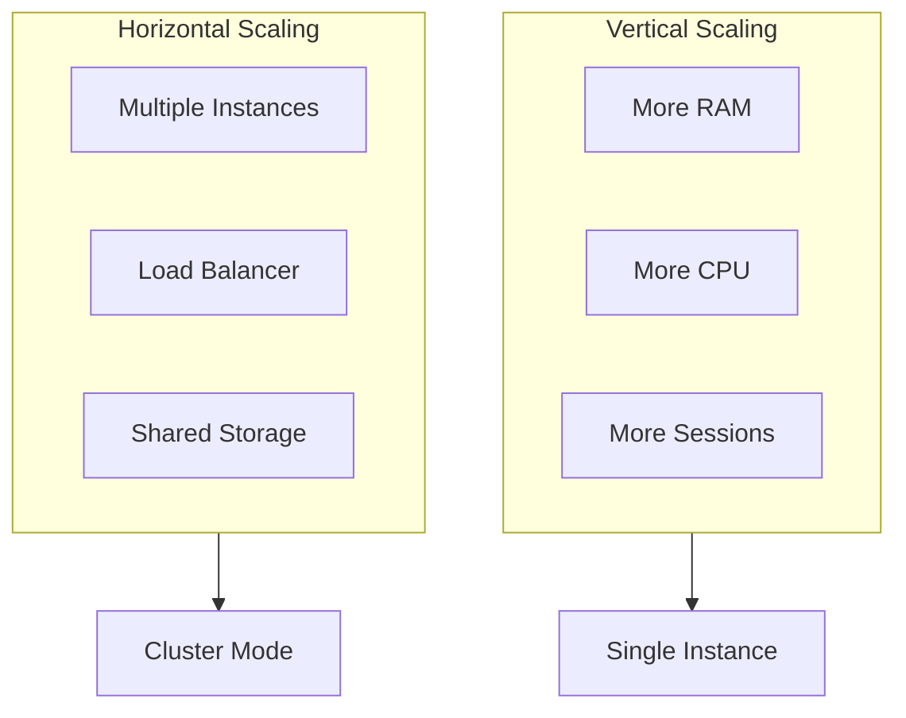

| ID         | Requirement                | Target                | Priority |
| ---------- | -------------------------- | --------------------- | -------- |
| NFR-SC-001 | Vertical scaling           | 20+ sessions/instance | Medium   |
| NFR-SC-002 | Horizontal scaling support | Multiple instances    | Low      |
| NFR-SC-003 | Stateless API design       | Session-independent   | High     |

### 2.3.4 Security

| ID         | Requirement        | Description             | Priority |
| ---------- | ------------------ | ----------------------- | -------- |
| NFR-SE-001 | API Authentication | API key required        | High     |
| NFR-SE-002 | Data encryption    | TLS for all connections | High     |
| NFR-SE-003 | Secret management  | Encrypted storage       | High     |
| NFR-SE-004 | Input validation   | Sanitize all inputs     | High     |
| NFR-SE-005 | Rate limiting      | Prevent abuse           | Medium   |
| NFR-SE-006 | Audit logging      | Track all operations    | Medium   |
| NFR-SE-007 | CORS configuration | Configurable origins    | Medium   |

### 2.3.5 Maintainability

| ID         | Requirement          | Description         | Priority |
| ---------- | -------------------- | ------------------- | -------- |
| NFR-MT-001 | Code coverage        | > 80% unit tests    | Medium   |
| NFR-MT-002 | Documentation        | API docs up-to-date | High     |
| NFR-MT-003 | Logging              | Structured logging  | High     |
| NFR-MT-004 | Modular architecture | Loosely coupled     | High     |
| NFR-MT-005 | Configuration        | Environment-based   | High     |

### 2.3.6 Usability

| ID         | Requirement       | Description             | Priority |
| ---------- | ----------------- | ----------------------- | -------- |
| NFR-US-001 | Setup time        | < 5 minutes with Docker | High     |
| NFR-US-002 | API documentation | Swagger/OpenAPI         | High     |
| NFR-US-003 | Error messages    | Clear & actionable      | High     |
| NFR-US-004 | Examples          | Working code examples   | Medium   |
| NFR-US-005 | Dashboard UX      | Intuitive interface     | Medium   |

### 2.3.7 Compatibility

| ID         | Requirement      | Description                | Priority |
| ---------- | ---------------- | -------------------------- | -------- |
| NFR-CP-001 | Node.js version  | 22 LTS                     | High     |
| NFR-CP-002 | Database support | SQLite, PostgreSQL         | High     |
| NFR-CP-003 | OS support       | Linux, macOS, Windows      | High     |
| NFR-CP-004 | Docker support   | Official image             | High     |
| NFR-CP-005 | ARM64 support    | Apple Silicon, ARM servers | Medium   |

## 2.4 Use Cases

### UC-001: Send Text Message

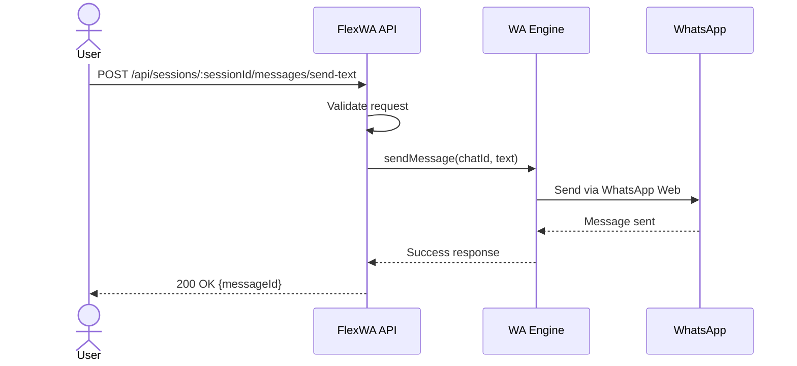

**Actors**: External application, Developer  
**Precondition**: Session is active and connected  
**Main Flow**:

1. User sends a POST request with `chatId` and `text`
2. The system validates the request
3. The system sends the message via the WhatsApp engine
4. The system returns the `messageId`

**Alternative Flow**:

- Session not active → Return 400 error
- Invalid phone number → Return 400 error
- WhatsApp error → Return 500 error

### UC-002: Receive Message via Webhook

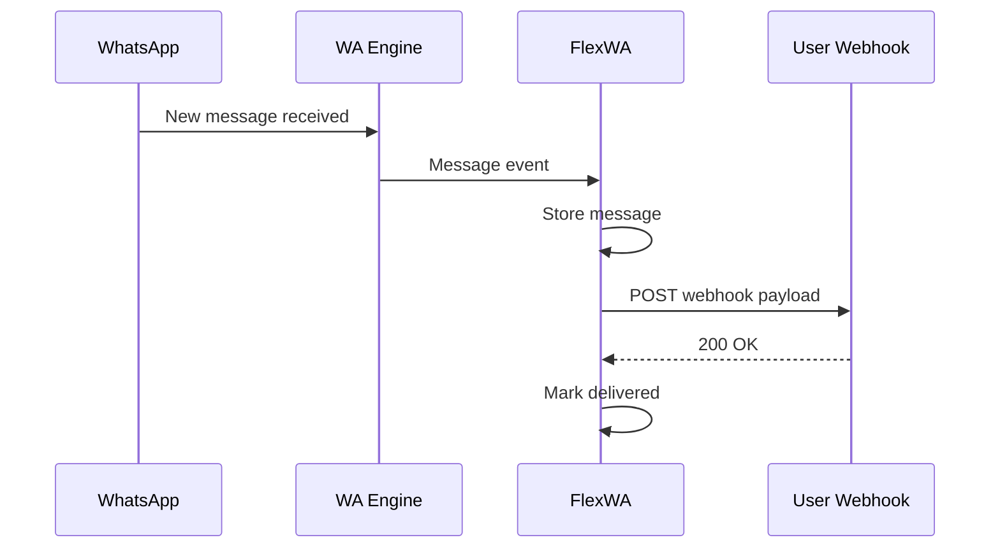

**Actors**: WhatsApp, External webhook endpoint  
**Precondition**: Webhook URL configured  
**Main Flow**:

1. WhatsApp sends a message to the session
2. The engine receives and forwards to the API
3. The API stores the message and sends it to the webhook
4. The webhook endpoint acknowledges

**Alternative Flow**:

- Webhook failed → Retry 3x
- All retries failed → Log and mark failed

### UC-003: Create New Session

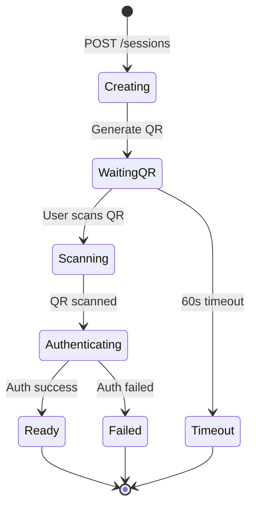

## 2.5 Requirements Traceability Matrix

| Requirement ID | Use Case | Test Case  | Status         |
| -------------- | -------- | ---------- | -------------- |
| FR-SM-001      | UC-003   | TC-SM-001  | ✅ Implemented |
| FR-SM-002      | UC-003   | TC-SM-002  | ✅ Implemented |
| FR-MSG-001     | UC-001   | TC-MSG-001 | ✅ Implemented |
| FR-WH-001      | UC-002   | TC-WH-001  | ✅ Implemented |

## 2.6 Acceptance Criteria

### Phase 1 MVP Acceptance Criteria

```
✓ A single session can be created and authenticated
✓ QR code can be scanned and session connected
✓ Text messages can be sent
✓ Image messages can be sent
✓ Incoming messages are forwarded to webhooks
✓ API documentation is available via Swagger
✓ Docker image can be built and run
✓ Basic health check endpoint works
```

### Phase 2 Acceptance Criteria

```
✓ Multiple sessions can run concurrently
✓ Dashboard can display all sessions
✓ Webhooks can be managed via UI
✓ PostgreSQL can be used as storage
✓ API key authentication works
✓ Rate limiting is enabled
```

---

<div align="center">

[← 01 - Project Overview](./01-project-overview.md) · [Documentation Index](./README.md) · [Next: 03 - System Architecture →](./03-system-architecture.md)

</div>
