# 03 - System Architecture

## 3.1 Architecture Overview

### High-Level Architecture

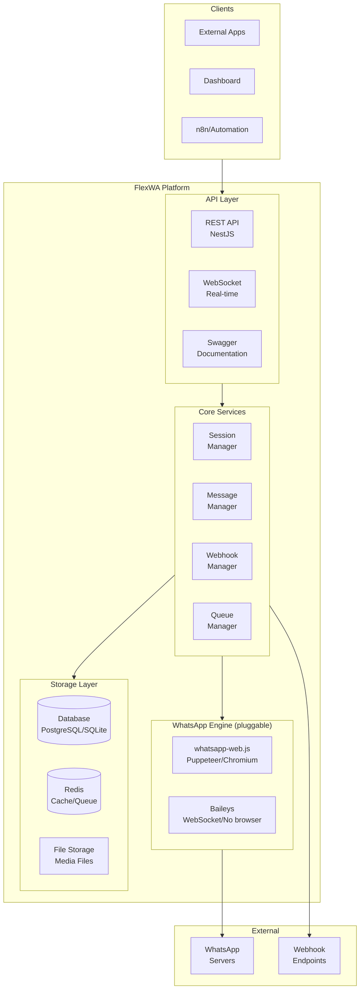

### Component Interaction

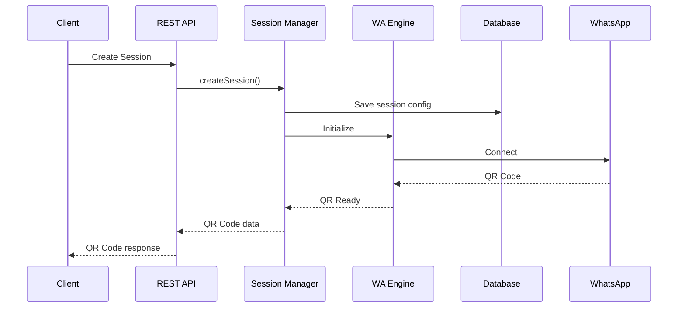

## 3.2 Pluggable Architecture Philosophy

FlexWA is designed with a **Pluggable Architecture** that allows infrastructure components to be swapped without changing application code. This enables flexible deployments ranging from minimal single-session bots to larger single-node, multi-session installs.

> **Note — single-instance:** the live WhatsApp engine layer is stateful and held in-process
> (an in-memory `Map` in `SessionService`). FlexWA currently runs as **one API instance per
> session-data volume**; horizontal scaling across multiple API replicas is a future design
> (not implemented). See [13 - Horizontal Scaling](13-horizontal-scaling.md).

### Design Philosophy

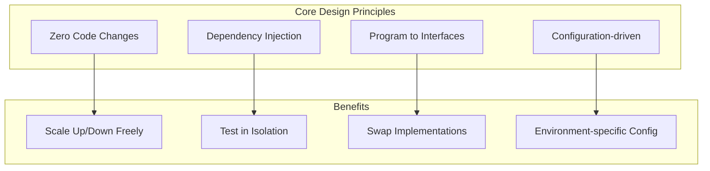

**Key Principles:**

| Principle                 | Description                                                                                                   | Example                                                 |
| ------------------------- | ------------------------------------------------------------------------------------------------------------- | ------------------------------------------------------- |
| **Program to Interfaces** | Core code depends on the `IWhatsAppEngine` abstraction, never on a concrete library                           | `IWhatsAppEngine` instead of `whatsapp-web.js` `Client` |
| **Dependency Injection**  | Services are wired via NestJS DI (constructor injection of `EngineFactory`, `StorageService`, `CacheService`) | `constructor(private engineFactory: EngineFactory)`     |
| **Configuration-driven**  | Backend selection via environment variables                                                                   | `STORAGE_TYPE=s3`, `ENGINE_TYPE=baileys`                |
| **Zero Code Changes**     | Switch backends without modifying application code                                                            | Change `.env`, restart                                  |

### Adapter Categories

The WhatsApp engine is the one true plug-in interface (`IWhatsAppEngine`, with concrete
adapters resolved through the plugin loader). The other "pluggable" backends are not behind a
formal `I*Adapter` interface — they are single services that branch internally on a config value:
`StorageService` (`storageType` = `local` | `s3`), `CacheService` (Redis or fail-open no-op), and
the TypeORM `data` connection (`sqlite` | `postgres`).

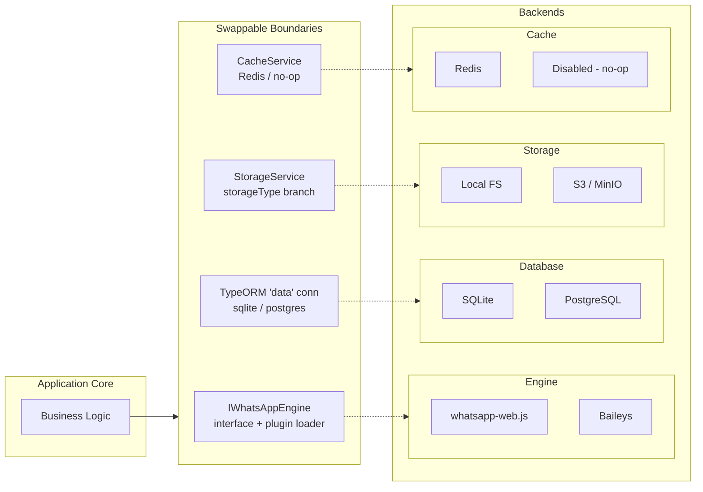

### WhatsApp Identity Contract (engine-neutral ids)

WhatsApp addresses the same entity through several id dialects, and each engine speaks a different one:
whatsapp-web.js uses `<phone>@c.us`, while Baileys speaks the raw protocol forms `<phone>@s.whatsapp.net`
and `<lid>@lid` (a privacy id whose number is **not** a phone number). To keep application code, the
REST/webhook payloads, and plugins free of that, the **engine boundary is an anti-corruption layer**:
every WhatsApp id an engine emits in a neutral field (`from` / `to` / `chatId` / `author`, contact and
chat `id`) is reduced to one small **neutral dialect**:

| Neutral form                                            | Meaning                                                                             |
| ------------------------------------------------------- | ----------------------------------------------------------------------------------- |
| `<phone>@c.us`                                          | a user, by phone (the raw `@s.whatsapp.net` form folds into this)                   |
| `<id>@g.us`                                             | a group                                                                             |
| `<lid>@lid`                                             | a user known **only** by privacy id - phone genuinely unknown (a first-class state) |
| `status@broadcast`, `<id>@newsletter`, `<id>@broadcast` | special channels                                                                    |

Never `@s.whatsapp.net`, never a `:device` suffix. **Resolution rule:** prefer `@c.us` (resolve a lid
to its phone when the mapping is known), and fall back to `@lid` only when it can't be resolved - an
unresolved lid is never faked into a phone number.

The shared implementation lives in `src/engine/identity/wa-id.ts` (`parseWaId` / `toNeutralJid`); the
contract is documented on the `IWhatsAppEngine` interface.

> **Rollout status:** the contract is applied per-engine. It currently covers the **Baileys inbound
> read path** (message / revoked / reaction payloads). Outbound id de-normalization (neutral -> engine
> dialect on send) and contact/chat list ids are tracked follow-ups.

### Engine Lifecycle State Machine

A WhatsApp engine moves through the `EngineStatus` enum
(`engine/interfaces/whatsapp-engine.interface.ts`). The adapter reports the current value via
`getStatus()` and pushes transitions to the host through the `onStateChanged` callback supplied to
`initialize()`:

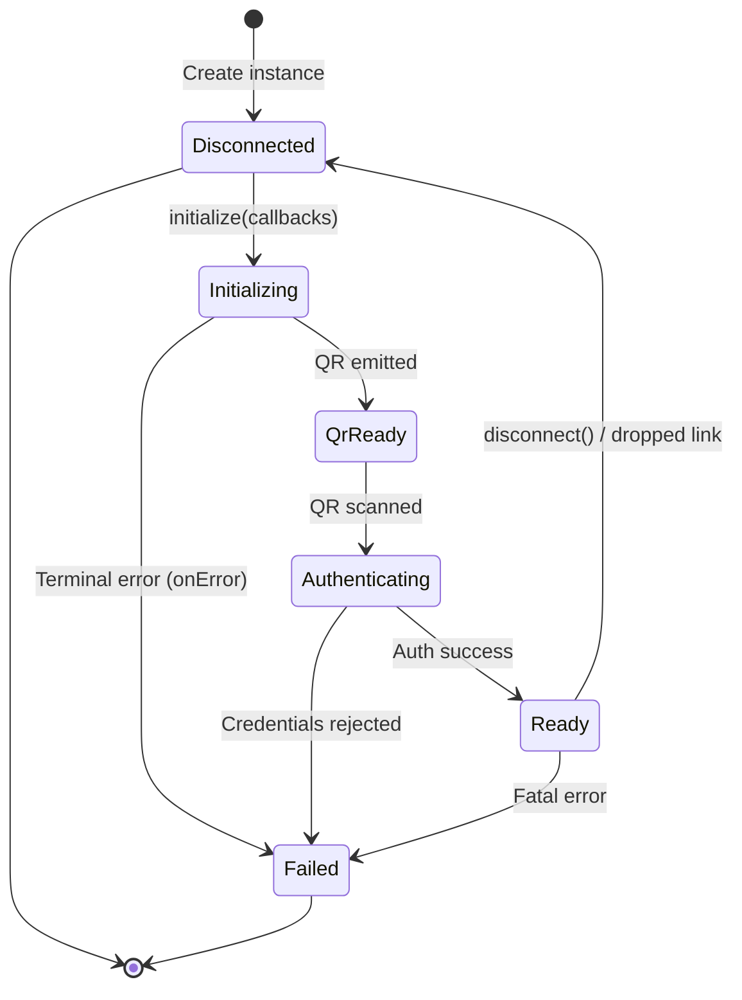

```typescript
// engine/interfaces/whatsapp-engine.interface.ts
export enum EngineStatus {
  DISCONNECTED = 'disconnected',
  INITIALIZING = 'initializing',
  QR_READY = 'qr_ready',
  AUTHENTICATING = 'authenticating',
  READY = 'ready',
  FAILED = 'failed',
}
```

There is no generic `IAdapterLifecycle`/`AdapterState` abstraction — only the engine carries an
explicit status enum. Storage, cache, and the database connection have no separate lifecycle type;
they follow the standard NestJS provider lifecycle (`OnModuleInit` / `OnModuleDestroy`).

### Dependency Injection & Module Wiring

FlexWA does **not** use a dynamic `AdaptersModule` or string DI tokens. `AppModule`
(`src/app.module.ts`) imports concrete feature modules directly and configures two **named TypeORM
connections**:

- **`main`** — always SQLite (`./data/main.sqlite`); owns the auth (`api_keys`) and audit
  (`audit_logs`) entities. Fixed boot config, not pluggable.
- **`data`** — the pluggable user-data connection: `sqlite` (default) or `postgres`, selected by
  `DATABASE_TYPE`. Owns the session/webhook/message/template/engine entities.

The engine is provided by `EngineModule` as the `EngineFactory` **class** (a normal injectable, not a
string token). Storage and cache are provided as the `StorageService` and `CacheService` classes by
their respective modules.

```typescript
// src/app.module.ts (shape)
@Module({
  imports: [
    ConfigModule.forRoot({ isGlobal: true, load: [configuration], validate: validateEnv }),

    // Auth + audit — always SQLite
    TypeOrmModule.forRootAsync({ name: 'main' /* ... ./data/main.sqlite ... */ }),

    // Pluggable user data — sqlite | postgres via DATABASE_TYPE
    TypeOrmModule.forRootAsync({ name: 'data' /* ... */ }),

    CacheModule, // provides CacheService
    StorageModule, // provides StorageService
    EngineModule, // provides EngineFactory
    SessionModule,
    MessageModule,
    WebhookModule /* ...other feature modules... */,
  ],
})
export class AppModule {}
```

### Using the Backends in Services

Services receive the backends by **constructor injection of the concrete class** — there is no
`@Inject('…_ADAPTER')` token:

```typescript
@Injectable()
export class SomeService {
  constructor(
    private readonly storage: StorageService, // branches local vs s3 internally
    private readonly cache: CacheService, // Redis when enabled, else a no-op
  ) {}

  async saveMedia(filePath: string, data: Buffer) {
    await this.storage.putFile(filePath, data); // path-safety guarded
    await this.cache.setSessionStatus('id', 'READY'); // no-op if Redis disabled
  }
}
```

### Runtime Configuration Flow

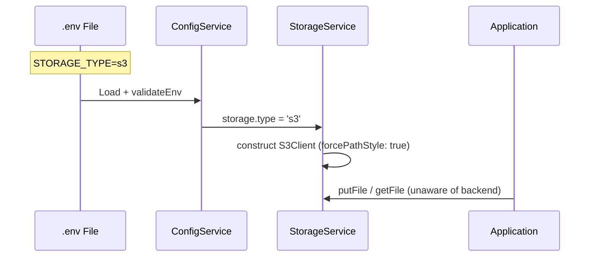

### Backend Selection Matrix

| Environment             | Database   | Storage  | Cache    | Engine          | Use Case                  |
| ----------------------- | ---------- | -------- | -------- | --------------- | ------------------------- |
| **Development**         | SQLite     | Local    | Disabled | whatsapp-web.js | Fast iteration, testing   |
| **Testing**             | SQLite     | Local    | Disabled | whatsapp-web.js | CI/CD, unit tests         |
| **Staging**             | PostgreSQL | Local    | Redis    | whatsapp-web.js | Pre-production validation |
| **Production (Small)**  | SQLite     | Local    | Disabled | whatsapp-web.js | 1-3 sessions, VPS         |
| **Production (Medium)** | PostgreSQL | Local    | Redis    | whatsapp-web.js | 5-10 sessions             |
| **Production (Large)**  | PostgreSQL | S3/MinIO | Redis    | whatsapp-web.js | 10+ sessions, HA          |

### Hot-Swap Considerations

> **Note:** Adapter hot-swap (changing adapter without restart) is **not supported** in v1.0. Changing adapter requires application restart.

Future considerations for hot-swap:

- Graceful connection draining
- State migration between adapters
- Zero-downtime switching

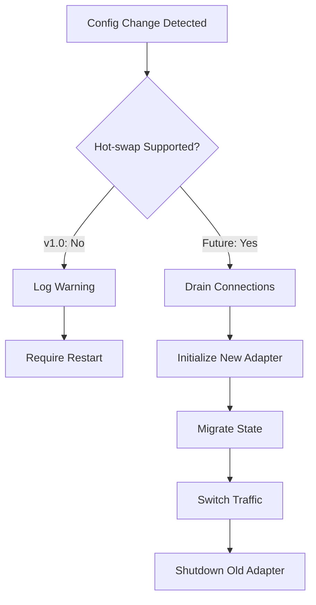

## 3.3 Layered Architecture

### Layered Architecture Pattern

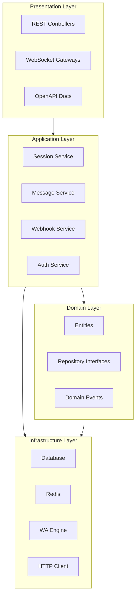

## 3.4 Module Structure

### NestJS Module Organization

```
src/
├── main.ts                     # Application entry point
├── app.module.ts               # Root module
│
├── common/                     # Shared utilities
│   ├── decorators/
│   ├── filters/
│   ├── guards/
│   ├── interceptors/
│   ├── pipes/
│   └── utils/
│
├── config/                     # Configuration
│   ├── config.module.ts
│   ├── config.service.ts
│   └── configuration.ts
│
├── modules/
│   ├── session/               # Session management
│   │   ├── session.module.ts
│   │   ├── session.controller.ts
│   │   ├── session.service.ts
│   │   ├── session.repository.ts
│   │   ├── dto/
│   │   └── entities/
│   │
│   ├── message/               # Message handling
│   │   ├── message.module.ts
│   │   ├── message.controller.ts
│   │   ├── message.service.ts
│   │   └── dto/
│   │
│   ├── webhook/               # Webhook management
│   │   ├── webhook.module.ts
│   │   ├── webhook.controller.ts
│   │   ├── webhook.service.ts
│   │   └── dto/
│   │
│   ├── contact/               # Contact management
│   │   ├── contact.module.ts
│   │   ├── contact.controller.ts
│   │   └── contact.service.ts
│   │
│   ├── group/                 # Group management
│   │   ├── group.module.ts
│   │   ├── group.controller.ts
│   │   └── group.service.ts
│   │
│   ├── auth/                  # Authentication
│   │   ├── auth.module.ts
│   │   ├── auth.guard.ts
│   │   └── api-key.strategy.ts
│   │
│   └── health/                # Health checks
│       ├── health.module.ts
│       └── health.controller.ts
│
├── engine/                    # WhatsApp engine wrapper
│   ├── engine.module.ts
│   ├── engine.service.ts
│   ├── engine.factory.ts
│   └── interfaces/
│
├── queue/                     # Job queue
│   ├── queue.module.ts
│   ├── processors/
│   └── jobs/
│
└── database/                  # Database
    ├── database.module.ts
    ├── migrations/
    └── seeds/
```

## 3.5 Core Components Design

### 3.5.1 Session Manager

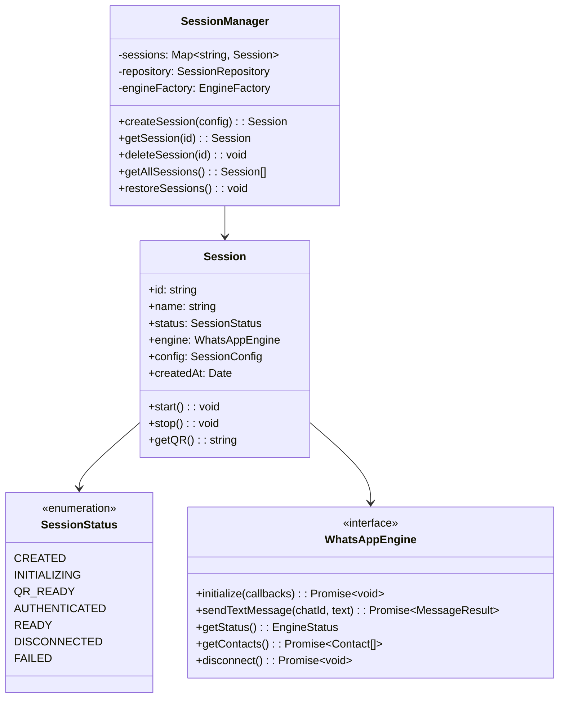

### 3.5.2 Message Flow

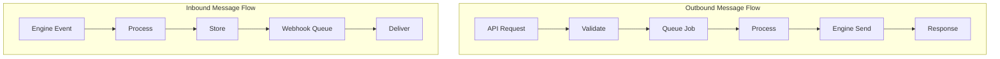

### 3.5.3 Webhook System

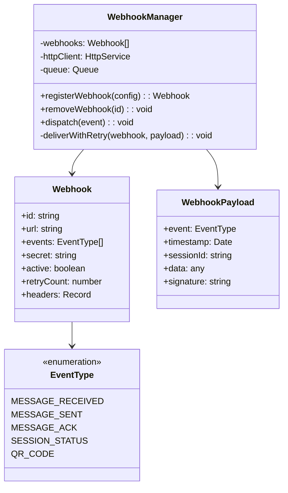

## 3.6 Data Flow Diagrams

### 3.6.1 Send Message Flow

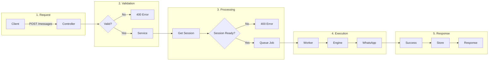

### 3.6.2 Webhook Delivery Flow

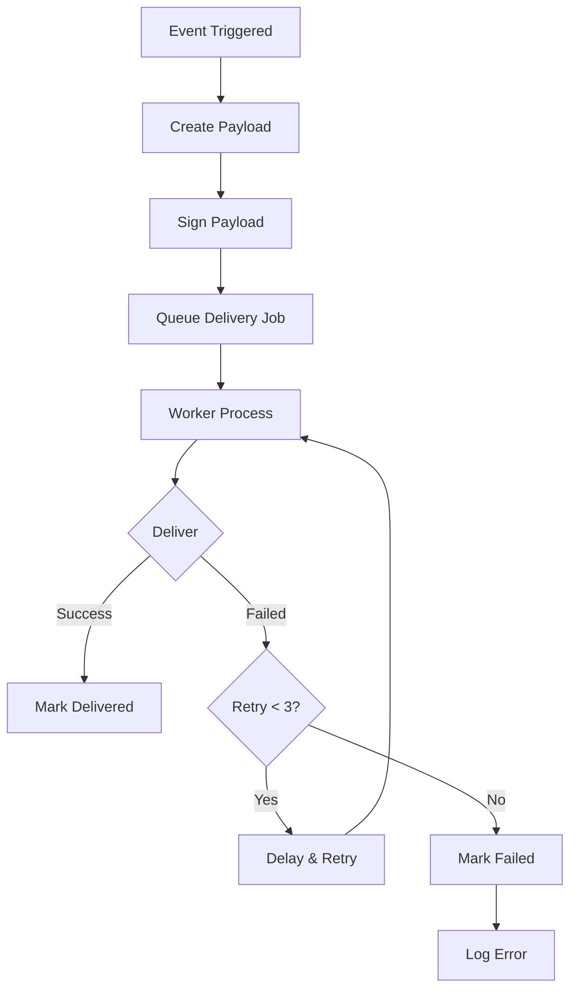

## 3.7 Technology Architecture

### 3.7.1 Runtime Environment

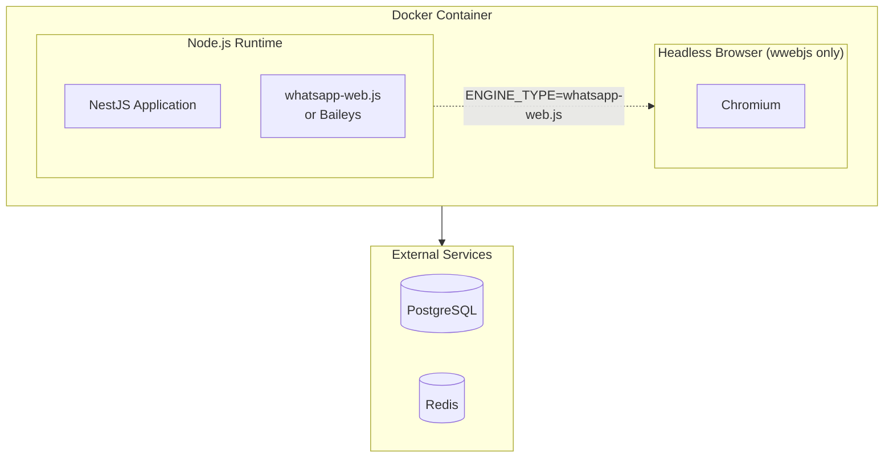

### 3.7.2 Deployment Architecture

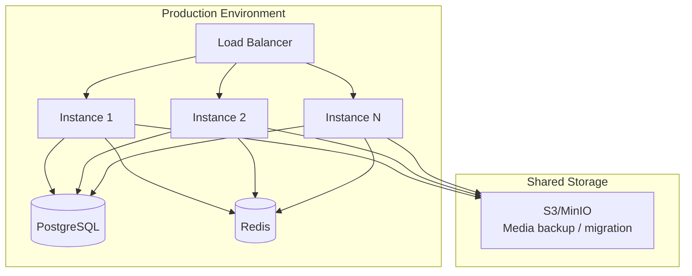

## 3.8 API Architecture

### RESTful API Design

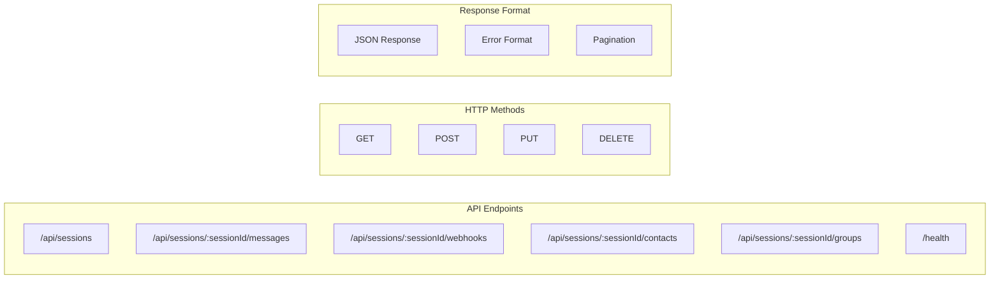

### API Response Structure

Responses are the **raw handler payload** — there is no `{success, data, meta}` envelope.
A controller that returns an object sends exactly that object; a list endpoint returns a bare array.
Errors use the NestJS default shape.

```typescript
// Success Response — the resource itself
{
  "id": "abc",
  "name": "my-session",
  "status": "READY"
}

// List Response — a bare array
[
  { "id": "abc", "name": "my-session", "status": "READY" },
  { "id": "def", "name": "other-session", "status": "DISCONNECTED" }
]

// Error Response — NestJS default shape
{
  "statusCode": 404,
  "message": "Session with id 'xxx' not found",
  "error": "Not Found"
}
```

## 3.9 Security Architecture

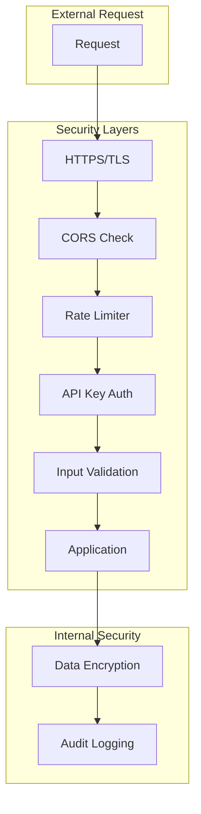

## 3.10 Error Handling Architecture

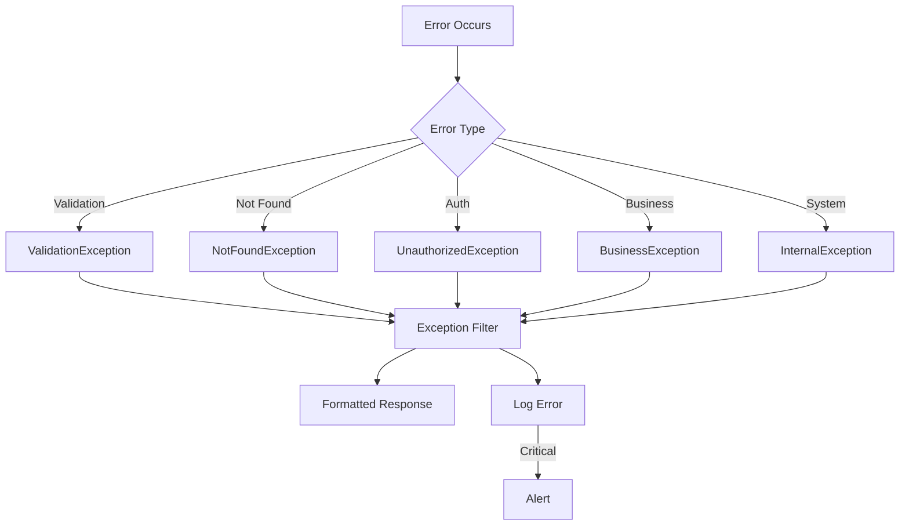

## 3.11 Scalability Considerations

### Horizontal Scaling Strategy

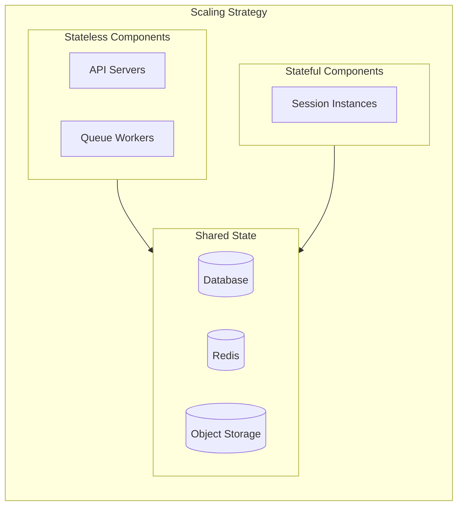

### Session Affinity

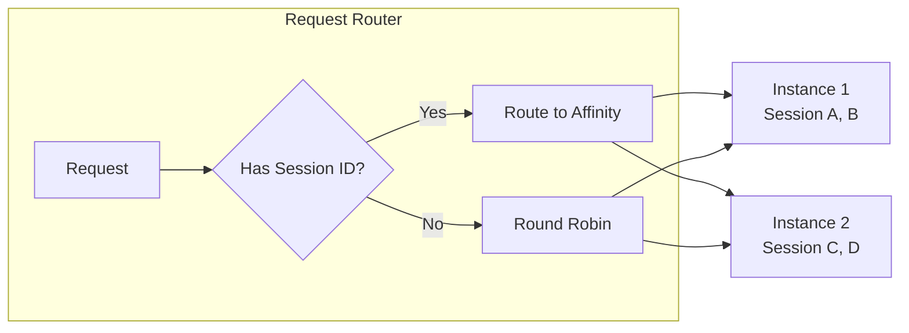

---

## 3.12 Engine Abstraction Layer

> [!IMPORTANT]
> Engine abstraction is critical to mitigate **R001: WhatsApp Protocol Changes** in Risk Management. FlexWA ships two production-ready engines selectable via `ENGINE_TYPE`: `whatsapp-web.js` (default, Chromium/Puppeteer-based) and `baileys` (browser-free, WebSocket/Noise protocol). With the abstraction layer, adding further engines requires no changes to application code.

### Strategy Pattern for Engine

```mermaid
classDiagram
    class IWhatsAppEngine {
        <<interface>>
        +initialize(callbacks): Promise~void~
        +disconnect(): Promise~void~
        +logout(): Promise~void~
        +destroy(): Promise~void~
        +forceDestroy(): Promise~void~
        +getStatus(): EngineStatus
        +getQRCode(): string | null
        +requestPairingCode(phone): Promise~string~
        +sendTextMessage(chatId, text): Promise~MessageResult~
        +sendImageMessage(chatId, media): Promise~MessageResult~
    }

    class WhatsAppWebJsAdapter {
        -client: Client
        +initialize(callbacks): Promise~void~
        +sendTextMessage(): Promise~MessageResult~
    }

    class BaileysAdapter {
        -socket: WASocket
        +initialize(callbacks): Promise~void~
        +sendTextMessage(): Promise~MessageResult~
    }

    class EngineFactory {
        +create(options: EngineCreateOptions): IWhatsAppEngine
    }

    IWhatsAppEngine <|.. WhatsAppWebJsAdapter
    IWhatsAppEngine <|.. BaileysAdapter
    EngineFactory --> IWhatsAppEngine
```

### Engine Interface Definition

Events are **not** delivered through an `on`/`off`/`once` emitter. Instead, the host passes a single
`EngineEventCallbacks` object to `initialize()`; the adapter invokes the registered callbacks for the
lifetime of the engine. Status is an `EngineStatus` **enum** (not a string union), `getQRCode()` is
**synchronous** (`string | null`), and there is no `connect()` / `isReady()` / `getAuthState()` — the
adapter connects inside `initialize()`.

```typescript
// engine/interfaces/whatsapp-engine.interface.ts
export enum EngineStatus {
  DISCONNECTED = 'disconnected',
  INITIALIZING = 'initializing',
  QR_READY = 'qr_ready',
  AUTHENTICATING = 'authenticating',
  READY = 'ready',
  FAILED = 'failed',
}

// All inbound signals arrive through callbacks supplied once to initialize().
export interface EngineEventCallbacks {
  onQRCode?: (qr: string) => void;
  onReady?: (phone: string, pushName: string) => void;
  onMessage?: (message: IncomingMessage) => void;
  onMessageCreate?: (message: IncomingMessage) => void; // outgoing (incl. linked-phone sends)
  onMessageAck?: (messageId: string, status: DeliveryStatus) => void;
  onMessageRevoked?: (message: RevokedMessage) => void;
  onMessageReaction?: (event: ReactionEvent) => void;
  onHistoryMessages?: (messages: IncomingMessage[]) => void; // bulk initial sync; persist, don't dispatch
  onDisconnected?: (reason: string) => void; // recoverable -> reconnect
  onStateChanged?: (state: EngineStatus) => void;
  onError?: (reason: string) => void; // terminal init/auth failure
}

export interface IWhatsAppEngine {
  // Lifecycle — connecting happens inside initialize(); callbacks are registered here.
  initialize(callbacks: EngineEventCallbacks): Promise<void>;
  disconnect(): Promise<void>; // close, keep session (reconnect without QR)
  logout(): Promise<void>; // clear session (requires QR scan again)
  destroy(): Promise<void>;
  forceDestroy(): Promise<void>; // kill this engine's own resources, then graceful teardown

  // Status / auth
  getStatus(): EngineStatus;
  getQRCode(): string | null; // synchronous
  requestPairingCode(phoneNumber: string): Promise<string>;
  getPhoneNumber(): string | null;
  getPushName(): string | null;

  // Messaging (selected)
  sendTextMessage(chatId: string, text: string): Promise<MessageResult>;
  sendImageMessage(chatId: string, media: MediaInput): Promise<MessageResult>;
  sendLocationMessage(chatId: string, location: LocationInput): Promise<MessageResult>;
  sendContactMessage(chatId: string, contact: ContactCard): Promise<MessageResult>;

  // Contacts / groups / chats — see the interface file for the full method set.
  getContacts(): Promise<Contact[]>;
  getGroups(): Promise<Group[]>;
  getChats(): Promise<ChatSummary[]>;
  // ...
}
```

### Engine Factory

The factory resolves the engine through the **plugin loader**, not a hard-coded `switch`. The
configured engine (`engine.type`, default `'whatsapp-web.js'`) is read once in the constructor; the
built-in `whatsapp-web.js` and `baileys` plugins are registered and the configured one is enabled in
`onModuleInit()`. `create()` takes an **options object** (engine-neutral per-call config —
`sessionId` / `proxyUrl` / `proxyType`), not a `type` argument. There is no `EngineType` union, no
`switch`, and no `Unknown engine type` throw: if the plugin is unavailable it logs a warning and
**falls back** to constructing a `WhatsAppWebJsAdapter` directly. (A typo in `ENGINE_TYPE` is rejected
at boot by `validateEnv`, which whitelists `whatsapp-web.js` | `baileys`.)

```typescript
// engine/engine.factory.ts
import { Injectable, OnModuleInit } from '@nestjs/common';
import { ConfigService } from '@nestjs/config';
import { IWhatsAppEngine } from './interfaces/whatsapp-engine.interface';
import { WhatsAppWebJsAdapter } from './adapters/whatsapp-web-js.adapter';
import { PluginLoaderService, PluginType, IEnginePlugin } from '../core/plugins';

export interface EngineCreateOptions {
  sessionId: string;
  proxyUrl?: string;
  proxyType?: 'http' | 'https' | 'socks4' | 'socks5';
}

@Injectable()
export class EngineFactory implements OnModuleInit {
  private readonly engineType: string;

  constructor(
    private readonly configService: ConfigService,
    private readonly pluginLoader: PluginLoaderService,
    /* ...message-store + lid-mapping deps... */
  ) {
    this.engineType = this.configService.get<string>('engine.type') ?? 'whatsapp-web.js';
  }

  async onModuleInit(): Promise<void> {
    // Register the built-in whatsapp-web.js + baileys engine plugins, then enable the configured one.
    await this.registerBuiltInEngines();
  }

  create(options: EngineCreateOptions): IWhatsAppEngine {
    const enginePlugin = this.pluginLoader.getPlugin(this.engineType);

    if (enginePlugin?.instance && this.isEnginePlugin(enginePlugin.instance)) {
      // Engine-specific config (e.g. Puppeteer) was handed to the plugin as an opaque blob at
      // registration, so the factory passes only engine-neutral per-call options here.
      return enginePlugin.instance.createEngine({
        sessionId: options.sessionId,
        proxyUrl: options.proxyUrl,
        proxyType: options.proxyType,
      }) as IWhatsAppEngine;
    }

    // Plugin missing -> warn and fall back to the direct whatsapp-web.js adapter (no throw).
    return this.createFallbackEngine(options);
  }
}
```

### WhatsApp-Web.js Adapter

```typescript
// engine/adapters/whatsapp-web-js.adapter.ts
import { Client, LocalAuth } from 'whatsapp-web.js';
import {
  IWhatsAppEngine,
  EngineEventCallbacks,
  EngineStatus,
  MessageResult,
} from '../interfaces/whatsapp-engine.interface';

export class WhatsAppWebJsAdapter implements IWhatsAppEngine {
  private client: Client | null = null;
  private status: EngineStatus = EngineStatus.DISCONNECTED;
  private callbacks: EngineEventCallbacks = {};

  // The host registers all event callbacks here; the adapter also connects inside initialize().
  async initialize(callbacks: EngineEventCallbacks): Promise<void> {
    this.callbacks = callbacks;
    this.setStatus(EngineStatus.INITIALIZING);

    this.client = new Client({
      authStrategy: new LocalAuth({ clientId: this.sessionId, dataPath: this.sessionDataPath }),
      puppeteer: { headless: true, args: ['--no-sandbox', '--disable-setuid-sandbox'] },
    });

    this.setupEventHandlers();
    await this.client.initialize();
  }

  private setupEventHandlers(): void {
    this.client!.on('qr', qr => {
      this.setStatus(EngineStatus.QR_READY);
      this.callbacks.onQRCode?.(qr);
    });
    this.client!.on('ready', () => {
      this.setStatus(EngineStatus.READY);
      this.callbacks.onReady?.(this.phoneNumber ?? '', this.pushName ?? '');
    });
    this.client!.on('disconnected', reason => {
      this.setStatus(EngineStatus.DISCONNECTED);
      this.callbacks.onDisconnected?.(String(reason));
    });
    this.client!.on('message', message => {
      this.callbacks.onMessage?.(this.toIncomingMessage(message)); // mapped to the neutral shape
    });
  }

  private setStatus(status: EngineStatus): void {
    this.status = status;
    this.callbacks.onStateChanged?.(status);
  }

  async disconnect(): Promise<void> {
    await this.client?.destroy(); // keep session; logout() clears it
    this.setStatus(EngineStatus.DISCONNECTED);
  }

  async sendTextMessage(chatId: string, text: string): Promise<MessageResult> {
    const message = await this.client!.sendMessage(chatId, text);
    return { id: message.id._serialized, timestamp: message.timestamp };
  }

  // ... full method set per the interface
}
```

### Baileys Adapter (Alternative Engine)

```typescript
// engine/adapters/baileys.adapter.ts
import makeWASocket, { DisconnectReason, useMultiFileAuthState } from '@whiskeysockets/baileys';
import {
  IWhatsAppEngine,
  EngineEventCallbacks,
  EngineStatus,
  MessageResult,
} from '../interfaces/whatsapp-engine.interface';

export class BaileysAdapter implements IWhatsAppEngine {
  private socket: ReturnType<typeof makeWASocket> | null = null;
  private status: EngineStatus = EngineStatus.DISCONNECTED;
  private callbacks: EngineEventCallbacks = {};

  // Baileys connects during initialize(); callbacks are registered here, same as the wwebjs adapter.
  async initialize(callbacks: EngineEventCallbacks): Promise<void> {
    this.callbacks = callbacks;
    this.setStatus(EngineStatus.INITIALIZING);

    const { state, saveCreds } = await useMultiFileAuthState(`${this.authDir}/${this.sessionId}`);
    this.socket = makeWASocket({ auth: state });
    this.socket.ev.on('creds.update', saveCreds);
    this.setupEventHandlers();
  }

  private setupEventHandlers(): void {
    this.socket!.ev.on('connection.update', update => {
      const { connection, lastDisconnect, qr } = update;
      if (qr) {
        this.setStatus(EngineStatus.QR_READY);
        this.callbacks.onQRCode?.(qr);
      }
      if (connection === 'open') {
        this.setStatus(EngineStatus.READY);
        this.callbacks.onReady?.(this.phoneNumber ?? '', this.pushName ?? '');
      }
      if (connection === 'close') {
        const loggedOut = (lastDisconnect?.error as any)?.output?.statusCode === DisconnectReason.loggedOut;
        this.setStatus(loggedOut ? EngineStatus.FAILED : EngineStatus.DISCONNECTED);
        this.callbacks.onDisconnected?.(loggedOut ? 'logged_out' : 'connection_closed');
      }
    });

    this.socket!.ev.on('messages.upsert', ({ messages }) => {
      for (const msg of messages) {
        if (!msg.key.fromMe) this.callbacks.onMessage?.(this.toIncomingMessage(msg)); // neutral ids
      }
    });
  }

  private setStatus(status: EngineStatus): void {
    this.status = status;
    this.callbacks.onStateChanged?.(status);
  }

  async sendTextMessage(chatId: string, text: string): Promise<MessageResult> {
    const result = await this.socket!.sendMessage(chatId, { text });
    return { id: result!.key.id!, timestamp: Math.floor(Date.now() / 1000) };
  }

  // ... full method set per the interface
}
```

### Engine Selection Configuration

```bash
# .env
ENGINE_TYPE=whatsapp-web.js  # Options: whatsapp-web.js (default), baileys

# Switch to the browser-free engine
ENGINE_TYPE=baileys
```

### Migration Strategy

```mermaid
flowchart TB
    subgraph Current["Available Engines"]
        A[whatsapp-web.js\nPuppeteer-based\ndefault]
        A2[Baileys\nWebSocket-based\nENGINE_TYPE=baileys]
    end

    subgraph Risk["Risk Detection"]
        B{Protocol\nBreaking?}
    end

    subgraph Migration["Migration Path"]
        C[Update whatsapp-web.js]
        D[Switch to Baileys]
        E[Community Fork]
    end

    subgraph Resolution["Resolution"]
        F[Service Restored]
    end

    A --> B
    B -->|Minor| C --> F
    B -->|Major wwebjs| D --> F
    B -->|Major Both| E --> F
```

### Engine Comparison

| Feature            | whatsapp-web.js       | Baileys             |
| ------------------ | --------------------- | ------------------- |
| **Protocol**       | Web (Puppeteer)       | Native WebSocket    |
| **Resource Usage** | High (~500MB/session) | Low (~50MB/session) |
| **Stability**      | Good                  | Good                |
| **Community**      | Large                 | Large               |
| **Multi-device**   | ✅                    | ✅                  |
| **QR Code**        | ✅                    | ✅                  |
| **Phone Link**     | ✅                    | ✅                  |
| **Maintenance**    | Active                | Active              |

### Benefits of Abstraction

1. **Risk Mitigation** - Swap engines without changing application code
2. **Testing** - The single `IWhatsAppEngine` boundary makes the engine trivial to stub/mock in unit tests
3. **Flexibility** - Run different engines per deployment via `ENGINE_TYPE`
4. **Future-proof** - New engines register as plugins; no changes to application code
5. **Comparison** - Evaluate engine resource/behavior trade-offs per environment

---

## 3.13 Pluggable Adapters

FlexWA uses the adapter pattern for infrastructure components that can be swapped per deployment needs. This allows users with limited resources to run FlexWA without heavyweight external dependencies.

### Adapter Overview

```mermaid
flowchart TB
    subgraph Core["FlexWA Core"]
        APP[Application Logic]
    end

    subgraph Adapters["Pluggable Backends"]
        subgraph Engine["WhatsApp Engine"]
            E1[whatsapp-web.js]
            E2[Baileys]
        end

        subgraph Database["Database"]
            D1[SQLite]
            D2[PostgreSQL]
        end

        subgraph Storage["Media Storage"]
            S1[Local Filesystem]
            S2[S3 / MinIO]
        end

        subgraph Cache["Cache"]
            C1[Redis]
            C2[Disabled - no-op]
        end
    end

    APP --> Engine
    APP --> Database
    APP --> Storage
    APP --> Cache
```

### Adapter Options

| Component           | Options (`ENV`)                          | Default         | Notes                                               |
| ------------------- | ---------------------------------------- | --------------- | --------------------------------------------------- |
| **WhatsApp Engine** | whatsapp-web.js, Baileys (`ENGINE_TYPE`) | whatsapp-web.js | Baileys is browser-free                             |
| **Database**        | SQLite, PostgreSQL (`DATABASE_TYPE`)     | SQLite          | PostgreSQL for large-scale production               |
| **Media Storage**   | local, s3 (`STORAGE_TYPE`)               | local           | MinIO is the `s3` backend (`forcePathStyle`)        |
| **Cache**           | Redis or disabled (`REDIS_ENABLED`)      | Disabled        | When disabled/unreachable, cache fails open (no-op) |

### 3.13.1 Storage Service

Media storage is a **single service** (`src/common/storage/storage.service.ts`) that branches
internally on `storageType` — there is no `I*Adapter` interface, separate adapter classes, or a
`StorageFactory`. The two backends are `local` (the default; files under `./data/media`) and `s3`.
The shipped producer/consumer is the storage export/import migration and backup flow. Incoming and
outgoing message media is returned inline to REST/webhook consumers and is **not** automatically
written through `StorageService`.
**MinIO is not a separate type** — it is the `s3` backend; the S3 client is always created with
`forcePathStyle: true`, which MinIO requires, and any S3-compatible endpoint works. The public method
set is `putFile` / `getFile` / `listFiles` / `createExportStream` (export) / `importFromStream`
(import), plus `getFileCount` and `getCurrentStorageType`.

```typescript
// src/common/storage/storage.service.ts
@Injectable()
export class StorageService {
  private readonly storageType: string; // 'local' | 's3'
  private readonly localPath: string;
  private s3Client: S3Client | null = null;

  constructor(private readonly configService: ConfigService) {
    this.storageType = this.configService.get<string>('storage.type') || 'local';
    this.localPath = this.configService.get<string>('storage.localPath') || './data/media';

    if (this.storageType === 's3') {
      const endpoint = process.env.S3_ENDPOINT; // S3 / MinIO endpoint
      const accessKeyId = process.env.S3_ACCESS_KEY_ID; // legacy S3_ACCESS_KEY also read
      const secretAccessKey = process.env.S3_SECRET_ACCESS_KEY;
      if (endpoint && accessKeyId && secretAccessKey) {
        this.s3Client = new S3Client({
          endpoint,
          region: process.env.S3_REGION || 'us-east-1',
          credentials: { accessKeyId, secretAccessKey },
          forcePathStyle: true, // Required for MinIO; harmless for AWS S3
        });
        // bucket auto-created if missing (HeadBucket -> CreateBucket)
      }
    }
    if (!fs.existsSync(this.localPath)) fs.mkdirSync(this.localPath, { recursive: true });
  }

  // Both backends share one path-safety guard (isSafeStorageKey) at this boundary.
  async putFile(filePath: string, data: Buffer): Promise<void> {
    if (!isSafeStorageKey(filePath)) throw new Error(`Refusing unsafe storage key: ${filePath}`);
    return this.storageType === 's3' && this.s3Client
      ? this.putS3File(filePath, data) // keyed under media/<filePath>
      : this.putLocalFile(filePath, data);
  }

  async getFile(filePath: string): Promise<Buffer> {
    /* mirrors putFile */
  }
  async listFiles(): Promise<string[]> {
    /* local recurse, or S3 ListObjectsV2 under media/ */
  }
  // createExportStream(): tar.gz of all files; importFromStream(): extract with zip-bomb caps
}
```

### 3.13.2 Database Adapter

FlexWA supports SQLite for lightweight deployments and PostgreSQL for high-volume production.

#### Database Comparison

| Feature                | SQLite             | PostgreSQL      |
| ---------------------- | ------------------ | --------------- |
| **Setup**              | Zero config        | Requires server |
| **Concurrent writes**  | Limited (1 writer) | Excellent       |
| **Horizontal scaling** | ❌                 | ✅              |
| **Table partitioning** | ❌                 | ✅              |
| **Memory footprint**   | ~10MB              | ~100MB+         |
| **Backup**             | Copy file          | pg_dump         |
| **Best for**           | 1-5 sessions       | 5+ sessions     |

#### TypeORM Configuration

Database wiring lives inline in `AppModule` (`src/app.module.ts`) as two named
`TypeOrmModule.forRootAsync` connections — there is no standalone `getDatabaseConfig` helper. The
`data` connection is the one shown below; the `main` connection is always SQLite (auth + audit). The
`data` connection's type comes from `DATABASE_TYPE` (`sqlite` default, or `postgres`):

```typescript
// shape of the 'data' connection useFactory in src/app.module.ts
const dbType = configService.get<'sqlite' | 'postgres'>('dataDatabase.type', 'sqlite');
const baseConfig = {
  entities: [
    /* session, webhook, message, template, engine entities */
  ],
  migrations: [__dirname + '/database/migrations/*{.ts,.js}'],
  logging: configService.get<boolean>('dataDatabase.logging', false),
};

if (dbType === 'postgres') {
  return {
    ...baseConfig,
    name: 'data',
    type: 'postgres',
    host: configService.get('dataDatabase.host'),
    port: configService.get('dataDatabase.port'),
    username: configService.get('dataDatabase.username'),
    password: configService.get('dataDatabase.password'),
    database: configService.get('dataDatabase.name', 'FlexWA'),
    synchronize: configService.get('dataDatabase.synchronize', false), // migrations in prod
    migrationsRun: true,
    extra: { max: configService.get('dataDatabase.poolSize', 10) },
  };
}

// SQLite (default): migration-managed unless DATABASE_SYNCHRONIZE=true
const synchronize = configService.get<boolean>('dataDatabase.synchronize', false);
return {
  ...baseConfig,
  name: 'data',
  type: 'sqlite',
  database: configService.get('dataDatabase.database', './data/FlexWA.sqlite'),
  synchronize,
  migrationsRun: !synchronize,
};
```

#### SQLite Considerations

> **Note:** FlexWA does not currently apply SQLite-specific concurrency hardening. There is **no**
> `journal_mode = WAL` PRAGMA, no `SqliteWriteQueueService`, and no application-level write
> serialization or session cap in the source. SQLite is used with TypeORM's defaults, so its standard
> single-writer behavior applies. For high write-concurrency or multi-session deployments, use
> PostgreSQL (`DATABASE_TYPE=postgres`). Cross-dialect schema differences are handled at migration
> time (see below), not by a runtime optimizations layer.

#### Migration Strategy

```typescript
// database/migrations/utils/database-aware-migration.ts

/**
 * Helper for writing migrations compatible with SQLite and PostgreSQL
 */
export abstract class DatabaseAwareMigration {
  protected isPostgres(queryRunner: QueryRunner): boolean {
    return queryRunner.connection.options.type === 'postgres';
  }

  protected isSqlite(queryRunner: QueryRunner): boolean {
    return queryRunner.connection.options.type === 'sqlite';
  }

  /**
   * Generate UUID default based on database type
   */
  protected getUuidDefault(queryRunner: QueryRunner): string {
    if (this.isPostgres(queryRunner)) {
      return 'gen_random_uuid()';
    }
    // SQLite: UUID must be generated at the application level
    return '';
  }

  /**
   * Get timestamp type based on database
   */
  protected getTimestampType(queryRunner: QueryRunner): string {
    if (this.isPostgres(queryRunner)) {
      return 'TIMESTAMP WITH TIME ZONE';
    }
    return 'DATETIME';
  }
}
```

### 3.13.3 Cache Service

There is **no** cache-manager / `CacheModuleOptions` / `redisStore` setup and **no** in-memory cache.
`CacheService` (`src/common/cache/cache.service.ts`) talks to **ioredis directly** and is gated by
`REDIS_ENABLED` (falling back to the `cache.enabled` config flag). When caching is disabled — or Redis
is unreachable — the service **fails open**: every read returns `null` and every write is a silent
no-op, so the app keeps serving from its source of truth. In other words, "no cache configured" means
**no cache** (recompute), not an in-process LRU. Cache is therefore a pure optimization layer (session
status/info/QR/list/stats, each with its own short TTL); it is never the source of truth.

```typescript
// src/common/cache/cache.service.ts
@Injectable()
export class CacheService implements OnModuleDestroy {
  private redis: Redis | null = null;
  private readonly enabled: boolean;

  constructor(private readonly configService: ConfigService) {
    // REDIS_ENABLED is the primary switch; cache.enabled is the legacy fallback.
    this.enabled = process.env.REDIS_ENABLED === 'true' || configService.get<boolean>('cache.enabled', false);
    // Lazy connect: the first isAvailable() call dials Redis (bounded retries).
  }

  async isAvailable(): Promise<boolean> {
    if (!this.enabled) return false; // disabled -> always "no cache"
    if (!this.redis) await this.tryConnect(); // bounded attempts
    return this.ping();
  }

  // Fail-open reads/writes: unavailable Redis is a no-op, never an error to the caller.
  async getSessionStatus(id: string): Promise<string | null> {
    if (!(await this.isAvailable())) return null;
    try {
      return await this.redis!.get(`session:${id}:status`);
    } catch {
      return null;
    }
  }

  async setSessionStatus(id: string, status: string): Promise<void> {
    if (!(await this.isAvailable())) return; // no-op when disabled/unreachable
    try {
      await this.redis!.setex(`session:${id}:status`, /* TTL */ 300, status);
    } catch {
      /* logged + swallowed */
    }
  }
}
```

### 3.13.4 Deployment Profiles

FlexWA provides several deployment profiles for different needs:

```mermaid
flowchart LR
    subgraph Minimal["🪶 Minimal Profile"]
        M1[SQLite]
        M2[Local Storage]
        M3[No Cache]
        M4[Single Session]
    end

    subgraph Standard["⚡ Standard Profile"]
        S1[PostgreSQL]
        S2[Local Storage]
        S3[Redis]
        S4[Multi Session]
    end

    subgraph Enterprise["🏢 Enterprise Profile"]
        E1[PostgreSQL Cluster]
        E2[S3/MinIO]
        E3[Redis Cluster]
        E4[Horizontal Scaling]
    end
```

| Profile        | Database   | Storage  | Cache | Sessions | RAM   | Use Case              |
| -------------- | ---------- | -------- | ----- | -------- | ----- | --------------------- |
| **Minimal**    | SQLite     | Local    | None  | 1-3      | 512MB | Personal bot, testing |
| **Standard**   | PostgreSQL | Local    | Redis | 5-10     | 2GB   | Small business        |
| **Enterprise** | PostgreSQL | S3/MinIO | Redis | 10+      | 4GB+  | Agency, high volume   |

> Session counts are guidance only by default. Set `MAX_CONCURRENT_SESSIONS` to a positive integer
> to cap concurrently running or initializing engines; the default `0` keeps the historical
> unlimited behavior.

### Configuration Examples

#### Minimal Profile (.env)

```bash
# Database
DATABASE_TYPE=sqlite
DATABASE_NAME=./data/FlexWA.sqlite

# Storage
STORAGE_TYPE=local
STORAGE_LOCAL_PATH=./data/media

# Cache: omit / leave Redis disabled -> the cache layer no-ops (no in-memory cache)
REDIS_ENABLED=false
```

#### Standard Profile (.env)

```bash
# Database (Postgres uses discrete host/port/credentials, not a single URL)
DATABASE_TYPE=postgres
DATABASE_HOST=localhost
DATABASE_PORT=5432
DATABASE_NAME=FlexWA
DATABASE_USERNAME=FlexWA
DATABASE_PASSWORD=password

# Storage
STORAGE_TYPE=local
STORAGE_LOCAL_PATH=./data/media

# Cache
REDIS_ENABLED=true
REDIS_HOST=localhost
REDIS_PORT=6379
```

#### Enterprise Profile (.env)

```bash
# Database
DATABASE_TYPE=postgres
DATABASE_HOST=db-cluster
DATABASE_PORT=5432
DATABASE_NAME=FlexWA
DATABASE_USERNAME=FlexWA
DATABASE_PASSWORD=password
DATABASE_POOL_SIZE=50

# Storage (S3 or any S3-compatible endpoint; MinIO uses the same vars)
STORAGE_TYPE=s3
S3_BUCKET=FlexWA-media
S3_REGION=ap-southeast-1
S3_ACCESS_KEY_ID=xxx
S3_SECRET_ACCESS_KEY=xxx
# AWS S3 needs NO endpoint (one is derived from the region) — leave S3_ENDPOINT unset for it. An
# endpoint is only for S3-compatible stores (MinIO, R2, …), where setting it also enables path-style:
# S3_ENDPOINT=http://minio:9000

# Cache
REDIS_ENABLED=true
REDIS_HOST=redis-cluster
REDIS_PORT=6379
```

> FlexWA runs as a single API instance per session-data volume; there is no cluster-mode flag.
> "Enterprise" here describes vertical headroom (RAM, Postgres, S3, Redis), not multi-replica
> horizontal scaling — see the single-instance note in §3.2.

### Choosing a Profile

FlexWA does not auto-detect a profile at runtime; pick one by available resources and expected load:

| Available RAM | Suggested profile | Backends                                          |
| ------------- | ----------------- | ------------------------------------------------- |
| < ~1 GB       | Minimal           | SQLite + Local Storage, Redis disabled (no cache) |
| ~1–4 GB       | Standard          | PostgreSQL + Local Storage + Redis                |
| > ~4 GB       | Enterprise        | PostgreSQL + S3/MinIO + Redis                     |

All profiles still run as a single API instance per session-data volume (see §3.2). Enterprise here
means more vertical headroom and external backends, not multi-replica clustering.

---

<div align="center">

[← 02 - Requirements Specification](./02-requirements-specification.md) · [Documentation Index](./README.md) · [Next: 04 - Security Design →](./04-security-design.md)

</div>
